# Phiếu trình — nghiệp vụ

> Phiếu trình = văn bản nội bộ trình lãnh đạo xem xét/phê duyệt một nội dung (đề xuất, xin chủ trương), có luồng ký riêng, **không phải văn bản đi** nhưng liên kết chặt với dự thảo văn bản đi. Bảng `SUBMISSION_FORM`, `SUBMISSION_FORWARD`, `SUBMISSION_MAP` ❓, file ký riêng. Chạy trên **BE gen-2** `SubmissionManagerController` (`/api/submission-manager`, 41 endpoint) — mẫu gen-2 tốt.

## 1. Actor

| Actor | Làm gì |
|---|---|
| Chuyên viên | Tạo phiếu trình (`create-or-update`), chọn người ký theo chức vụ (`get-list-position`), đính kèm file, **đính kèm dự thảo chưa trình** hoặc **phiếu trình đã hoàn thành vào dự thảo**, gửi trình (`submit`), hủy (`cancel`), xóa (`delete`), thêm vào hồ sơ (`add-to-brief`) |
| Người ký (lãnh đạo phòng → lãnh đạo đơn vị) | Ký phiếu (`submission-file/sign`) hoặc trả lại (`reject-sign`), chuyển xin ý kiến (`tranfer-give-advice`, `update-advice`), **ký luôn dự thảo đính kèm** nếu mình là người ký cuối của cả hai (`confirmSignDocumentDraft.zul`, `get-document-draft-after-sign`) |
| Người nhận để biết | `submissionFormReceiveToKnow.zul` |
| Văn thư / người theo dõi | Danh sách xử lý phiếu trình (menu *Danh sách xử lý phiếu trình*), chuyển tiếp (`send`, `submission-forward`, `get-list-submission-forward`, `get-list-sender-history`), cập nhật số trang giấy (`update-num-page`, `updatePaperNumberInSubmissionMap`) |

## 2. Trạng thái (`voffice.submissionForm.label.status.*`)

| Key | Hiển thị | Ý nghĩa |
|---|---|---|
| `draft` | Chưa trình | Đang soạn |
| `processing` | Đang xử lý | Đã submit, đang qua các người ký |
| `sentBack` | Bị trả lại | Người ký từ chối → sửa, trình lại |
| `reSigned` | Trình ký lại | Vòng mới sau khi bị trả |
| `completed` | Đã phê duyệt | Người ký cuối đã ký |
| `rejected` | Đã hủy | Người tạo hủy |

Tab màn xử lý (`submissionFormProcess`): *Chờ xử lý / Đã phê duyệt / Đã trả lại / Dự thảo chờ ký / Đang xử lý / Tất cả*.

```mermaid
stateDiagram-v2
  [*] --> ChuaTrinh
  ChuaTrinh --> DangXuLy: submit (kiểm tra check-submission-attachments-for-submitting)
  DangXuLy --> DangXuLy: ký từng cấp / xin ý kiến
  DangXuLy --> BiTraLai: reject-sign
  BiTraLai --> DangXuLy: trình ký lại
  DangXuLy --> DaPheDuyet: người ký cuối ký
  DaPheDuyet --> [*]: đính vào dự thảo / hồ sơ; nếu người ký cuối = người ký dự thảo → ký luôn dự thảo
  ChuaTrinh --> DaHuy: cancel
  DangXuLy --> DaHuy: cancel
```

## 3. Liên kết với dự thảo văn bản đi (xác nhận từ nghiệp vụ)

| Case | Điều kiện | Hệ quả |
|---|---|---|
| Phiếu trình **đính kèm dự thảo chưa trình** | Chuyên viên chọn dự thảo (`textAction.searchTextForSubmission`, `submission-form-by-text-id`, `get-file-by-submission-form-id-and-text-id`) | Khi ký phiếu trình, nếu **người ký cuối phiếu trình = người ký dự thảo** → hệ thống cho **ký văn bản luôn** (`confirmSignDocumentDraft`, tab *Dự thảo chờ ký*) |
| Dự thảo **đính kèm phiếu trình đã hoàn thành** | Trong `requisition_add` chọn phiếu trình `completed` | Phiếu trình là sở cứ; kiểm tra `api.brief-detail.check-text-doc-for-submitting` ❓ |
| Đính kèm phiếu trình khi trình | `check-submission-attachments-for-submitting` | Chặn trình nếu phiếu trình đính kèm chưa hợp lệ |

## 4. Quy tắc

- QT1. Phải nhập nội dung trình và tiêu đề (`notification.notChoose`, `not.empty`).
- QT2. File phiếu trình ký số như văn bản (dùng chung cơ chế `ky-so`; file mật qua `file-encrypt-map`).
- QT3. SMS thông báo khi phiếu được/không được thông qua (`SUBMISSION_FORM_PASS_STATUS_SMS = 702`).
- QT4. Đếm trang giấy để thống kê in ấn (`update-num-page`) ❓ mục đích.
- QT5. Có quyền theo đơn vị (`get-org-submission`), tổng hợp theo người tạo (`get-total-submission-by-creator`), dashboard (`count-home`).

## 5. Liên quan: "Yêu cầu / kiến nghị đề xuất" (`requestAction`, gen-1)

Khác phiếu trình: là **khó khăn vướng mắc** gửi lên cấp trên (`request.status`: chưa gửi → đã gửi → đang giải quyết → đã giải quyết / đã chuyển cấp trên / đã đóng; `request.action`: giao đơn vị, giao cá nhân, tự giải quyết, gửi lên cấp trên, đóng, từ chối kết quả) và có thể **sinh nhiệm vụ** (`requestProcess.action = tao.cong.viec`). Web `request/*.zul` (12) + `vm/request/*`; cấu hình người nhận kiến nghị `ProposalBusiness` (`requestAction.*RequestEmpConfig`, menu *Cấu hình cá nhân nhận kiến nghị*). ❓ Nếu team coi đây là phân hệ riêng thì tách folder `kien-nghi`.

## ❓
1. Phiếu trình có nhiều cấp ký cố định (phòng → đơn vị) hay theo luồng `FLOW`?
2. `update-all-submission-7939827832452673672323443432323` là endpoint migrate dữ liệu một lần? Có nên xóa?
3. Phiếu trình "ký luôn dự thảo": chữ ký đặt lên file dự thảo hay chỉ đổi trạng thái?
