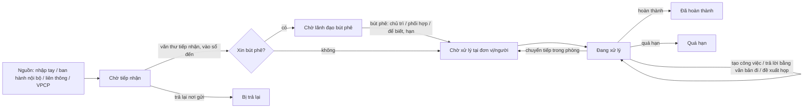

# Văn bản đến — nghiệp vụ: tiếp nhận → bút phê → chuyển xử lý → xử lý/trả lời → hoàn thành

> Bản ghi `DOCUMENT` (đã có số). Người/đơn vị được giao nằm ở `DOCUMENT_IN_STAFF` / `DOCUMENT_IN_GROUP`; bút phê ở `DOC_LEADER_COMMENT`; trả lời ở `ANSWER_DOCUMENT`/`DOCUMENT_REPLY`. Văn bản đến có thể sinh từ: văn thư nhập tay (`inputDoc`), văn bản đi của đơn vị khác trong hệ thống (khi ban hành), liên thông từ ngoài (`van-ban/lien-thong`), VPCP (`goverment`), migrate (`MigratedDoc`).

## 1. Actor

| Actor | Làm gì |
|---|---|
| Văn thư (`SYS_ROLE_VT`) | Tiếp nhận / nhập văn bản đến (`inputDoc`), vào sổ đến (`GetRegisterNumberIndex`, kiểm tra trùng số `is-duplicated-register-number`), scan/đính kèm, chuyển lãnh đạo bút phê hoặc chuyển thẳng phòng xử lý, trả lại nơi gửi (`return-document`), báo cáo gửi nhận (`reportSendReceiveDoc`), bàn giao (`handoverDoc`) |
| Lãnh đạo đơn vị (`SYS_ROLE_LDDV`, `TTDV`) | **Bút phê** (`DocLeaderComment`, `getListCommentLeaderFromDocument`), phân công chủ trì/phối hợp, gia hạn (`ExtendDocument`), yêu cầu trả lời (`needAnswer`), theo dõi tiến độ đơn vị (`orgFollowerDocIn`) |
| Lãnh đạo phòng / trưởng nhóm | Nhận văn bản với vai trò chủ trì → chuyển tiếp cho chuyên viên (`sendDocument`, `sendDocumentMultiTransfer` — nhiều văn bản một lần), chia nhỏ (`SplitDocument`) |
| Chuyên viên (`SYS_ROLE_NV`) | Xử lý: đọc (`UpdateReadingStatus`), tạo công việc từ văn bản (`cong-viec`, `getListTaskFromDocument`), soạn văn bản trả lời (`replyDocument` → dự thảo ở `van-ban/di`), đánh dấu đã xử lý (`tickProcessedDoc`, `complete-document`), đề xuất họp (`addMeetingRequest`, `requestToScheduleMeetingDoc`), đưa vào hồ sơ (`processingTranferBriefDoc`), trình xem xét (`doSubmitForConsideration`) |
| Trợ lý / văn thư phòng | Cấu hình tự động chuyển (`documentProcessTermConfig.saveAutoProcessSetting`, `addOrUpdateAutoSendConfig`) |

## 2. Trạng thái

### 2.1 Trạng thái văn bản đối với người/đơn vị nhận (`document.status`, cột `STATUS` trong `DOCUMENT_IN_STAFF`/`DOCUMENT_IN_GROUP`)

| Key | Hiển thị | Ý nghĩa |
|---|---|---|
| `pendingReception` | Chờ tiếp nhận | Văn thư chưa tiếp nhận (menu *Văn bản chờ tiếp nhận*) |
| `pendingProcessing` | Chờ xử lý | Đã chuyển tới, chưa mở/chưa nhận |
| `processing` | Đang xử lý | |
| `processing.warning` / `nearDeadline` | Sắp đến hạn | Tính từ hạn xử lý |
| `overdue` | Đã quá hạn | |
| `needAnswer` | Yêu cầu trả lời | Lãnh đạo/nơi gửi yêu cầu văn bản trả lời |
| `returned` | Bị trả lại | `return-document`, `DeleteDocumentReturned` |
| `completed` | Đã hoàn thành | `complete-document` (gen-2 kiểm tra nhắc việc còn mở: `check-completion-reminders`) |
| `inCompleted` | Chưa hoàn thành | |

Thống kê tiến độ theo hạn (`document.processStatus`): *Đang xử lý / Hoàn thành đúng hạn / Hoàn thành quá hạn / Chưa hoàn thành quá hạn* (`get-documents-processing-stats-by-user`, `searchReceiveWithProcessingStatsByUser`).

### 2.2 Trạng thái bút phê (`document.documentStatus`)

*Chưa xin lãnh đạo bút phê → Chờ lãnh đạo bút phê → Đã phê duyệt / Bị từ chối*; hoặc *Văn bản không cần xin ý kiến*.

### 2.3 Vai trò khi nhận (`document.processType` / `document.transfer`)

| Code | Hiển thị | Ý nghĩa |
|---|---|---|
| `main` / `sendTo` | Chủ trì | Chịu trách nhiệm xử lý, được phép chuyển tiếp, hoàn thành |
| `coordinate` / `carbonCopy` | Phối hợp | Tham gia, không đóng văn bản |
| `toKnow` / `receiveToKnow` | Nhận để biết | Chỉ đọc |
| `situation` | Nắm tình hình | Lãnh đạo theo dõi |

Cờ **đã đọc/chưa đọc** riêng theo người (`updateReadingStatusV2`, `get-percent-read-doc`).

### 2.4 Sơ đồ

## 3. Các bước

1. **Tiếp nhận** (`document/inputDoc`): nhập số ký hiệu, cơ quan ban hành (`getListOfficeOutside`), ngày, loại, độ mật/khẩn, trích yếu, file; kiểm tra trùng (`list-exist-document-by-textbook-and-register`); chọn sổ đến (`getAllTextBooksOfUserByOrgForDocIn`); có thể OCR tóm tắt (`Files.d2SOCRSummarizeDocument`); xác thực chữ ký ngoài (`verifyExternalSignature`).
2. **Xin bút phê / chuyển lãnh đạo**: `is-existing-send-to-preside`; lãnh đạo bút phê `save-doc-leader-comment` kèm phân công.
3. **Chuyển xử lý** (`document/transferDoc`, `process/`): người nhận lấy từ luồng `api.flow-manager.doc-in.get-users-next-step*` / `get-groups-next-step*` (luồng văn bản đến cấu hình ở `van-ban/luong-xu-ly`); nhóm chuyên viên (`CvGroupAction`), nhóm cá nhân (`getListReceivedPersonalGroup`); chuyển nhiều văn bản (`sendDocumentMultiTransfer`, `updateIsForwardByDocumentIdMultiTransfer`).
4. **Hạn xử lý**: cấu hình theo loại/đơn vị (`documentProcessTermConfig.*`, menu *Cấu hình hạn xử lý văn bản*); gia hạn `ExtendDocument`; cảnh báo sắp hạn/quá hạn (nhắc việc, SMS).
5. **Xử lý & trả lời**: trả lời bằng văn bản đi (`answerDocumentAction.replyDocument`, `insertDocumentReply`, liên kết `getRepliedDocumentIds`); yêu cầu trả lời (`sendDocumentReplyRequest`, `getReturnList`); tạo công việc (`cong-viec`); tạo nhiệm vụ (`nhiem-vu`, `updateDocumentProposal`); đề xuất họp (`hop`).
6. **Hoàn thành**: `tickProcessedDoc` / `complete-document` (gen-2 chặn nếu còn nhắc việc chưa trả lời — `check-completion-reminders`), `updateStatusDocumentInStaff/Group`.
7. **Theo dõi/báo cáo**: luân chuyển (`exportCirculationTree`, `ReportdocumentTransferHistory`, menu *Xem luân chuyển văn bản đơn vị*), gửi nhận (`report-doc-in`, `export-daily-document`, `export-daily-vptwd-document`), theo dõi đơn vị (`orgFollowerDocIn`).
8. **Bàn giao** khi người xử lý nghỉ (`DocumentHandoverAction.handOverDocument`, `tableOfIncomingDocuments`).
9. **Văn bản không chính thức / nắm tình hình** (`document-informality` = `graspSituation`): văn bản gửi ngoài luồng văn thư cho nhóm lãnh đạo nắm tình hình; chuyển văn bản đến sang dạng này (`update-to-informality`), trợ lý xử lý (`is-document-assistant`). Chi tiết ở `lich-nhac-viec/nghiep-vu.md` §4.

## 4. Quy tắc

- QT1. Số đến duy nhất theo sổ + năm (`is-duplicated-register-book-number`).
- QT2. Chỉ **chủ trì** được hoàn thành/đóng; phối hợp và để biết không đóng được (❓ xác nhận trong `updateStatusDocumentInStaff`).
- QT3. Không hoàn thành nếu còn nhắc việc chưa xử lý (gen-2 `check-completion-reminders`) — quy tắc mới đi cùng tính năng nhắc việc.
- QT4. Văn bản mật: file mã hóa theo người (`api.doc-in.*file-encrypt-map*`, `issued.encrypted-files`).
- QT5. Quyền xem theo `checkPermitViewDocument` + phạm vi văn bản (`documentScope`: đơn thư / công văn đến tập đoàn / đến đơn vị khác).
- QT6. Văn bản đến từ liên thông có thể là bản đã tồn tại (`update-exist-connect-document`) → gộp thay vì tạo mới.

## 5. ❓ Cần xác nhận

1. Bút phê có bắt buộc với mọi văn bản đến hay tuỳ loại (`documentStatus = van.ban.khong.can.xin.y.kien`)?
2. Ai được "trả lại nơi gửi" và có thông báo ngược qua liên thông không?
4. Trạng thái `needAnswer` do ai đặt: nơi gửi khi ban hành hay lãnh đạo khi bút phê?
