# Văn bản đi — nghiệp vụ giai đoạn TỪ CẤP SỐ TRỞ ĐI (chờ cấp số → cấp số → đóng dấu → ban hành/chuyển → hủy ban hành / công khai / thay thế)

> Viết lại từ code nhánh `kha_develop` (web-spring + backend2.0) ngày 2026-09-30; đã đối chiếu DB DEV (chỉ SELECT) ngày 2026-09-30. Mọi khẳng định có nguồn `file:dòng`.
> Viết tắt đường dẫn:
> `WEB/` = `web-spring/src/main/java/com/viettel/` · `ZUL/` = `web-spring/src/main/webapp/view/voffice/` ·
> `BIZ/` = `web-spring/src/main/java/com/voffice/service/business/` · `BE1/` = `backend2.0/backendvoffice/src/main/java/com/viettel/voffice/` ·
> `BE2/` = `backend2.0/backendvoffice/src/main/java/com/viettel/office/`.
> VM hay dùng: **RVM** = `WEB/voffice/vm/requisition/RequisitionVM.java`, **RVDVM** = `WEB/voffice/vm/requisition/RequisitionViewDetailVM.java`,
> **VBBHVM** = `WEB/voffice/vm/requisition/RequisitionVbbhVM.java`, **DOVM** = `WEB/voffice/vm/document/DocumentOutVM.java`,
> **DLVM** = `WEB/voffice/vm/document/DocumentLookUpVM.java` (form Cấp số). Logic BE: **TC** = `BE1/controler/TextController.java`,
> **TDAO** = `BE1/database/dao/text/TextDAO.java`, **TSDAO** = `BE1/database/dao/document/TextSearchDAO.java`, **TBDAO** = `BE1/database/dao/document/TextBookDAO.java`.
> Giai đoạn TRƯỚC (dự thảo → ký → chuyển cấp số) đã viết ở [`../../xu-ly-cong-viec/nghiep-vu.md`](../../xu-ly-cong-viec/nghiep-vu.md) — file này chỉ trỏ sang, không lặp lại.

## 1. Tổng quan

### 1.1 Phạm vi

Văn bản đi sau khi người ký cuối ký xong (hoặc dự thảo được "Chuyển cấp số") có `TEXT.STATE = 3` và rơi vào hộp việc của **văn thư đơn vị ban hành**.
Từ đây phân hệ gồm:

- Hộp việc **Văn bản ban hành** (`SYS_MENU.CODE = VBBH`, 6 tab) và hộp việc **Văn bản đóng dấu** (`VBDD`) — NV-01, NV-07.
- **Cấp số** theo sổ văn bản → sinh bản ghi `DOCUMENT`, `TEXT.STATE = 4` (NV-02); **Cấp số & đóng dấu** một lần (NV-03).
- **Văn thư trả lại** văn bản chờ cấp số cho người tạo / người trong luồng (NV-04).
- **Hủy ban hành / từ chối cấp số** → `TEXT.STATE = 27` (NV-05).
- **Xin dấu**, **đóng dấu** (một hoặc nhiều đơn vị, theo vị trí ký hoặc tùy chọn), **từ chối đóng dấu**, **hủy đóng dấu** (NV-06 → NV-09).
- **Tự động ban hành** sau khi ký (NV-10); **"ban hành" = chuyển văn bản đã cấp số** (`DOCUMENT.IS_FORWARD`) — chỉ mô tả điểm bàn giao (NV-11).
- **Công khai văn bản**, **văn bản thay thế**, **phát hành ra ngoài** (NV-12 → NV-14); **xóa / khôi phục văn bản đi, cấp bù số** (NV-15); danh sách số đã cấp (NV-16); mobile (NV-17); đồng bộ đóng dấu sang ERP `textMarkSync` (NV-07 BR-27).

Phân hệ **KHÔNG gồm** (trỏ sang):

| Nội dung | Phân hệ |
|---|---|
| Dự thảo, trình ký, xin ý kiến, ký nháy/ký duyệt/phê duyệt, văn thư xét duyệt, trả lại trong luồng, "Chuyển cấp số" (đưa dự thảo vào hàng chờ) | `xu-ly-cong-viec` |
| Khai báo sổ văn bản, số hiện tại, sổ dùng chung, **số chờ/giữ số** (`WAITING_NUMBER_BOOK`, `/api/text-book-manager/*-waiting-number`) | `van-ban/so-van-ban` |
| MỌI luồng **chuyển văn bản** (văn thư chuyển văn bản đã cấp số, tự động chuyển sau cấp số/ban hành, cây/phạm vi chọn đơn vị–cá nhân của văn thư phát hành) | `van-ban/chuyen-van-ban` (xem mục 8) |
| Gửi trục liên thông / VPCP | `van-ban/lien-thong` |
| Kỹ thuật ký số / đóng dấu số (USB token, CloudCA, băm file, ảnh dấu) | `ky-so` |
| Văn bản đến ở đơn vị nhận (sau khi được chuyển) | `van-ban/den` |

### 1.2 Menu thực tế (DB DEV, `SYS_MENU`, 2026-09-30)

| `SYS_MENU_ID` | Cha | `CODE` | Tên | URL | `STATUS`/`DEL_FLAG` |
|---|---|---|---|---|---|
| 337321 | 337232 VĂN BẢN ĐI | `VBBH` | Văn bản ban hành | `/view/voffice/requisition/requisition_vbbh.zul?view=8` | 1/0 |
| 338952 | 337232 VĂN BẢN ĐI | `VBDD` | Văn bản đóng dấu | `/view/voffice/requisition/requisition.zul?view=9` | 1/0 |
| 439905 | 337232 VĂN BẢN ĐI | `VBBH_LD` | Văn bản ban hành (menu cho lãnh đạo + chuyên viên) | `/view/voffice/document/reportSendReceiveDoc/documentOut.zul?view=9` | 1/**1 (đã xóa)** |
| 337793 | 337200 VĂN BẢN ĐẾN | `CBVB` | Công khai văn bản | `/view/voffice/document/documentPublish/document_publish.zul` | 1/0 |
| 339272 | 337200 VĂN BẢN ĐẾN | `DOCUMENT_OUT` | Danh sách văn bản đi | `/view/voffice/document/reportSendReceiveDoc/documentOut.zul?view=3` | 1/0 |

- Không có menu nào trỏ `view=19` (`VBCCS`): hằng `VIEW_TYPE.VBCCS = 19` (`WEB/util/AppConstants.java:769`, `BE1/constants/Constants.java:782,960`) **không có nhánh xử lý** nào trong code (grep `VBCCS` chỉ ra dòng khai báo). "Chờ cấp số" thực tế là **tab 1 của màn VBBH** (NV-01).
- RVM và DOVM tìm dòng menu `VBBH` bằng `iCommon.findByParent(SysMenu.class, "VBBH", "code", null)` (RVM:805-807; DOVM:734-736) — đổi `CODE` menu này sẽ làm lỗi màn.

### 1.3 Actor & quyền

Các cờ `hasSave/Update/DeletePermission` của VM mặc định `true` (thiết kế chung, xem `xu-ly-cong-viec/nghiep-vu.md` mục 1.2). Quyền thực tế = menu + điều kiện dữ liệu trong SQL + kiểm tra ở BE.

| Actor | Nhận diện trong code | Làm gì |
|---|---|---|
| **Văn thư đơn vị ban hành** | Web: `isDocManager` (có role `RbParamValue.USER_ROLE.DOCUMENT_MANAGER`; `orgDocManagerIds` — RVM:668-674). BE: `Vof2_EntityUser.getListSecretaryVhrOrg()` (đơn vị user là văn thư — `BE1/controler/DocumentController.java:11617-11620`), role `Constants.SYS_ROLE_VT` (TDAO:9171). Hộp *Chờ cấp số* còn đòi phân quyền dữ liệu `REVIEW_PROMULGATE_DATA` (TSDAO:3178-3184) | Cấp số, cấp số & đóng dấu, trả lại, hủy ban hành, đóng dấu, từ chối/hủy đóng dấu, chuyển văn bản đã cấp số, xem 6 tab |
| Người không phải văn thư (lãnh đạo, chuyên viên) | `!isDocManager` | Chỉ tab **Đã ban hành** (VBBHVM:199-202) và luôn ở phạm vi **cá nhân** `orgRangeState = 1` (DOVM:685-688, 1198) |
| Người tạo dự thảo | `TEXT.CREATOR_ID_VOF2` | Nhận SMS khi được cấp số (`PUBLISH_DOC_NEW`), khi bị trả lại, khi đóng dấu/từ chối đóng dấu; **Xin dấu** ở màn Văn bản trình ký (`checkViewAskSeal` — RVDVM:10077-10087) |
| Văn thư đơn vị được xin dấu | `TEXT_MARK.ORG_ID` ∈ đơn vị có văn thư (TSDAO:7316-7440) | Đóng dấu / từ chối đóng dấu ở menu VBDD |
| Hệ thống ngoài (ký tự động) | `AUTO_DIGSIG_TRANSACTION`, `EXT_APP` (TDAO:3071-3079) | Nhận kết quả ban hành/hủy ban hành/đóng dấu |

Kiểm tra IDOR ở BE: `TDAO.validateGetTextDetail` (TDAO:9149-…) — chỉ bật khi `SYSTEM_PARAMETER.VALIDATE_ATTT = 1` (`FunctionCommon.openValidateATTT` — `BE1/constants/FunctionCommon.java:2369-2371`; TDAO:9150-9152; DB DEV = 1); cho qua nếu user là người tạo, người trong `TEXT_PROCESS`, văn thư/lãnh đạo đơn vị liên quan, hoặc hệ thống ngoài (`EXT_APP`). Được gọi ở `documentPromulgate` (TC:1779-1782), `cancelDocumentPublish` (TC:1977-1981), `askForSeal` (TC:6163-6167), `rejectMark` (TC:6246-6250), `markDocumentByOrg`, `rollBackDauDonVi`. **Không** gọi ở `returnCreatorTextByVtPromulgate` / `rejectSignTextVBBHWaitForNumber` (TC:6383-6568) — xem `dac-thu.md`.

## 2. Module

| Chức năng | Màn (.zul) | VM | Business (key) | Endpoint BE | Controller / logic | DAO / bảng |
|---|---|---|---|---|---|---|
| Khung 6 tab Văn bản ban hành | `ZUL/requisition/requisition_vbbh.zul` | VBBHVM | — | — | — | — |
| Tab Chờ cấp số / Đã trả lại / Từ chối cấp số | `ZUL/requisition/requisition.zul` (`view=8`, include theo tab) | RVM (`viewType = VBBH = 8`) | `RequisitionBusiness.getRequisitionList/countRequisitionList(type = TYPE_VBBH = 4)` → `textAction.searchText` (`BIZ/RequisitionBusiness.java:1886-1921`) | `POST /textAction/searchText` | TC `searchText` (TC:539-567) | `TSDAO.getLstTextSign(searchType = PUBLISHED_SIGN)` (TSDAO:3164) — `TEXT`, `TEXT_PROCESS`/`TEXT_PROCESS_HISTORY`, `TEXT_MARK`, `DOCUMENT` |
| Tab Đã cấp số / Đã ban hành / Tất cả | `ZUL/document/reportSendReceiveDoc/documentOut.zul`, `documentOut_dcs_dbh.zul` | DOVM (`viewType` 8/9/10) | `DocumentBusiness.getDocumentOut` → `DocumentAction.searchDocumentOut` (`BIZ/DocumentBusiness.java:5014-5057`) | `POST /DocumentAction/searchDocumentOut` | `BE1/controler/DocumentController.java::searchDocumentOut` :11487 | `BE1/database/dao/document/search/DocumentSearchOutService.java::searchDocumentOut` — `DOCUMENT`, `TEXT`, `TEXT_BOOK`, `TEXT_MARK` |
| Xem chi tiết văn bản chờ cấp số | `ZUL/requisition/requisition_viewDetail.zul` | RVDVM (`viewType = 8`) | `getRequisitionDetailV2` … | `/textAction/getTextDetail*` | TC | TDAO |
| Cấp số (form) | `ZUL/document/reportSendReceiveDoc/issussDocument.zul` (`ViewConstant.WIDGETS.ISUSS_DOCUMENT_LOOKUP` — `WEB/voffice/common/ViewConstant.java:337`) | DLVM | `RequisitionBusiness.publishDocument` → `textAction.documentPromulgate` (`BIZ/RequisitionBusiness.java:2446-2485`); `TextBookBusiness.getTextBooksByOrgIdAndDocType`, `getNextRegisterNumberDataByTextBookId`; `DocumentBusiness.isDuplicatedRegisterNumberDocOut` → `api.doc-out.is-duplicated-register-number` | `POST /textAction/documentPromulgate`; `/textBookAction/getTextBooksByOrgIdAndDocType`, `/textBookAction/getNextRegisterNumberByTextBookId`; `GET /api/doc-out/is-duplicated-register-number` | TC `documentPromulgate` :1685; `BE1/controler/TextBookController.java` :487, :540; `BE2/controller/DocOutController.java` | `TDAO.updateDocumentPromulgate` :2671; `TBDAO` :1064, :1228, :1355 — `DOCUMENT`, `FILES_ATTACHMENT`, `TEXT`, `TEXT_BOOK`, `TEXT_BOOK_NUMBER`, `TEXT_MANUAL_NUMBER` |
| Văn thư trả lại | popup `ConfirmInputVM` từ `requisition_viewDetail.zul:4919-4945` | RVDVM `doRejectVBBHWaitForNumber` :5106 | `returnCreatorTextByVtPromulgate` / `rejectSignTextVBBHWaitForNumber` (`BIZ/RequisitionBusiness.java:5398, 5434`) | `/textAction/returnCreatorTextByVtPromulgate`, `/textAction/rejectSignTextVBBHWaitForNumber` | TC :6383, :6458 | `TDAO.rejectByVtPromulgate` :6999, `TDAO.rejectSignText` :6633 — `TEXT`, `TEXT_PROCESS`, `TEXT_PROCESS_HISTORY` |
| Hủy ban hành | `ZUL/requisition/rejectPublish.zul` (`ViewConstant.java:338`) | `WEB/voffice/vm/requisition/RejectPublishVM.java` | `rejectPublishDocument` → `textAction.cancelDocumentPublish` (`BIZ/RequisitionBusiness.java:2417-2435`) | `POST /textAction/cancelDocumentPublish` | TC :1953 | `TDAO.cancelDocumentPublish` :4003 — `TEXT`, `DOCUMENT`, `CONNECT_DOCUMENT`, `BRIEF_*` |
| Xin dấu | popup `PopupAskForSealVM` (`WEB/voffice/widget/PopupAskForSealVM.java`) | RVDVM `askForSeal` :10057 | `askForSeal`, `getOrgMarkedList` (`BIZ/RequisitionBusiness.java:5186, 5217`) | `/textAction/askForSeal`, `/textAction/getOrgMarkedList` | TC :6146, :6115 | `TDAO.askForSeal` :6563, `getOrgMarkedList` :6492 — `TEXT_MARK`, `IMAGE_ORG` |
| Hộp Văn bản đóng dấu | `ZUL/requisition/requisition.zul?view=9` | RVM (`viewType = VBDD = 9`) | `getTextMarkList/countTextMarkList(type = TYPE_VBDD = 8)` (`BIZ/RequisitionBusiness.java:5228-5300`) → `textAction.searchText` | `/textAction/searchText` | TC :539-543 | `TSDAO.getTextMarkList` :7316 |
| Đóng dấu / từ chối / hủy đóng dấu | `requisition_viewDetail.zul:4841-4871`; ConfirmSign | RVDVM `doApproveMark` :10165, `doRejectMark` :10129, `doRollBackDDDV` :11042; RVM `doMarkAllSelected*` :13235-13285 | `markDocumentByOrg` (:5457), `rejectMark` (:5323), `rollBackDauDonVi` (:5726), `getListOrgPermissionMark` (:5510), `getListOrgMultiMarkRequisition` (:6516); `DocumentAction.checkPermissionRollBack` (:8211); ký qua `Sign.*` | `/textAction/markDocumentByOrg`, `/rejectMark`, `/rollBackDauDonVi`, `/getListOrgPermissionMark`, `/getListOrgMultiMarkRequisition`; `/DocumentAction/checkPermissionRollBack`; `/Sign/updateDatabaseAfterMark` | TC :6571, :6227, :6812, :6668, :7859; `BE1/controler/signature/SignController.java:3302`; `BE1/utils/SignUtils.java` | `TDAO.markDocumentByOrg` :7488, `rejectMark` :6605, `approveMark*` :7364/:8402, `rollBackTextMark` :8154, `rollBackText` :8171; `OrgDAO` :545, :678 — `TEXT_MARK`, `MARK_ATTACH_HISTORY`, `MARK_LOCATION`, `ATTACH`, `FILES_ATTACHMENT` |
| Tự động ban hành | — (chạy nền sau ký) | — | — | (trong `/textAction/updateDatabaseSign`) | `BE1/thread/ThreadExcuteAfterSigned.java::promulgateTextAuto` :742 | `TDAO.updateDocumentPromulgate`, `TextCommonDAO.getRegisterNumberByTextBook` |
| Công khai văn bản | `ZUL/document/documentPublish/document_publish.zul`, `popupPublishVB.zul`, `popupPublishVBEdit.zul` | `DocumentPublishVM`, `DocumentPublishViewDetailVM` | `DocumentPublishBusiness` (`DocumentPublishAction.actionSearchDocPublish`, `DocumentAction.publish/editPublicationInformation/editTmpPublicationInformation/cancelPublish/publishListDoc`) | `/DocumentPublishAction/*`, `/DocumentAction/publish` … | `BE1/controler/DocumentController.java` :1360, :1593, :1847, :2065, :2306; `BE1/controler/DocumentPublishControler.java` | `DocumentDAO.publishDocument` :1594, `manuallyPublishV2` :1876, `cancelPublish` :2461; `DocumentPublishDAO` — `DOCUMENT_PUBLISHED`, `DOCUMENT_PUBLISHED_TMP`, `DOCUMENT_SCOPE_REF`, `DOC_ORG_REPUBLISH` |
| Văn bản thay thế (khi công khai) | `ZUL/document/documentPublish/document_publish_replace.zul` | `DocumentPublishReplaceVM` | `DocumentPublishBusiness.getDocPublish*`, `getListDocPublishReplace` → `DocumentPublishAction.getListDocAlter` | `/DocumentPublishAction/getListDocAlter` | `DocumentPublishControler` :342 | `DocumentPublishDAO.getListDocAlter`; `DOCUMENT_ALTERNATIVE` |
| Xóa / khôi phục văn bản đi | `ConfirmLockVM` (DOVM); icon xóa ở `requisition_search.zul:1453` | DOVM, RVM `doDeleteRequisition` :17375 | `DocumentBusiness.deleteDocument` → `DocumentAction.DeleteDocument`; `RequisitionBusiness.doDeleteRequisition` (:7642), `restoreDocument` (:8406) | `/DocumentAction/DeleteDocument`, `/textAction/doDeleteRequisition`, `/textAction/restoreDocument` | `DocumentController.deleteDocument` :927; TC :8620-8651, :9721 | `DocumentDAO.deleteDocument` :976; `TDAO.doDeleteRequisition` :10549, `restoreDocument` :9649 |
| Danh sách số đã cấp | `ZUL/document/issueDocument/issue_document_list.zul`; xem: `requisition_issue_number_view_detail.zul`, `reportSendReceiveDoc/popupVB_issue_number.zul` | `RequisitionViewIssueNumberVM`; RVDVM; `DocumentViewDetailVM` | `AnswerDocumentBusiness`, `RequisitionBusiness.getRequisitionDetailV2` | … | … | … |
| Đồng bộ đóng dấu sang ERP | — | DOVM :8358-8364 (và các VM văn bản khác) | `RequisitionBusiness.addTextMarkSync` | `/textMarkSyncAction/addTextMarkSync` (+ `getTextMarkSync`, `getListDocumentSync`, `getTextDetailSync` cho hệ thống ngoài kéo) | `BE1/controler/TextMarkSyncControler.java` | `TextMarkSyncDAO` — `TEXT_MARK_SYNC` |

Endpoint gen-2 `/api/doc-out/*` (`BE2/controller/DocOutController.java`, 12 endpoint): trong phạm vi cấp số web dùng `is-duplicated-register-number` (`BIZ/DocumentBusiness.java:6140-6151`); web còn gọi các endpoint `*file-encrypt*` / `add-permission-confidential-file` (quyền file văn bản mật), `get-list-document-completes`, `get-text-process-flow` (`BIZ/RequisitionBusiness.java:7065-8254`, `BIZ/DocumentBusiness.java:6246`) — thuộc `ky-so`/`van-ban/quan-ly-chung`. `/text/add-text-files`, `/text/delete-text-files` (`BE2/controller/TextFileController.java`) là file của dự thảo (bảng `TEXT_ATTACH*`) — thuộc `xu-ly-cong-viec`.

## 3. Nghiệp vụ

### NV-01. Hộp việc "Văn bản ban hành" (6 tab) và phạm vi đơn vị / cá nhân

**Mục đích.** Văn thư theo dõi toàn bộ văn bản đi của đơn vị mình từ lúc chờ cấp số đến khi đã chuyển đi; người không phải văn thư xem văn bản đã ban hành liên quan tới mình.

**Actor.** Văn thư (6 tab); người khác chỉ tab *Đã ban hành* (VBBHVM:199-202).

**Luồng.** `requisition_vbbh.zul` khai báo 6 tab (`ZUL/requisition/requisition_vbbh.zul:16-21`), mỗi tab `include` lười (lazy) một màn con và truyền `tabType` (VBBHVM:208-284):

| # | Tab | `tabType` | Màn con | Điều kiện hiện bản ghi (BE) | Ai thấy |
|---|---|---|---|---|---|
| 0 | **Chờ cấp số** | `waitForNumberTab` (RVM `tabTypeVBBH = 7`, lọc `state = 3` — RVM:788-789, 2014-2016) | `requisition.zul?view=8` | `TEXT.STATE = 3`, `IS_DELETED = 0`, có `TEXT_PROCESS` **hoặc** có `REGISTING_NUMBER_DATE` (dự thảo chuyển cấp số) (TSDAO:3352-3353), `OFFICE_PUBLISHED_ID_VOF2` ∈ đơn vị trong phân quyền dữ liệu `REVIEW_PROMULGATE_DATA` của user (TSDAO:3178-3184, 3949-3999), loại văn bản ∉ tham số `TYPE_NOT_PROMULGATE` (TSDAO:3677, 3698-3709); lọc thêm trạng thái đóng dấu nếu chọn (TSDAO:3720-3724) | Văn thư có phân quyền `REVIEW_PROMULGATE_DATA` |
| 1 | **Đã cấp số** | `numberedTab` → DOVM `viewType = DCS = 8` (DOVM:693-694) | `document/reportSendReceiveDoc/documentOut.zul` | `DOCUMENT.STATUS_NUMBER` ≠ 1, `IS_ACTIVE` null/1 (DocumentSearchOutService:246-256), **`IS_FORWARD` null hoặc ≠ 1** (:268-269), `BUILT_GROUP_ID` ∈ đơn vị user là văn thư (:343-349) | Văn thư |
| 2 | **Đã ban hành** | `issuedTab` → `DBH = 9` (DOVM:695-696) | `documentOut.zul` | như trên nhưng **`IS_FORWARD = 1`** (:270-273) — riêng phạm vi cá nhân và `promulIndex ≠ 1` thì **không** xét `IS_FORWARD` (:271) | Văn thư (đơn vị/cá nhân); người khác (cá nhân) |
| 3 | **Đã trả lại** | `returnForNumberTab` → `stateCancel = VTBH_TL = 15` (RVM:795-798; `AppConstants.java:801`) | `requisition.zul?view=8` | `TEXT_PROCESS_HISTORY` của văn bản có bản ghi `SIGNATURE_TYPE = -2`, `STATE = 2`, `EMP_VHR_ID = user` (TSDAO:3312-3318, 3685-3688) — tức **các văn bản chính user (văn thư) đã trả lại**; cột thao tác bị ẩn (RVM:1515-1517) | Văn thư đã trả lại |
| 4 | **Từ chối cấp số** | `cancelIssueTab` → `stateCancel = HBH = 27` (RVM:791-794) | `requisition.zul?view=8` | `TEXT.STATE = 27` **và** `DELETED_PROMULGATE` null (TSDAO:3680-3684); cùng điều kiện đơn vị như tab 0 | Văn thư |
| 5 | **Tất cả** | `allTab` → `ALL = 10` (DOVM:697-698) | `documentOut_dcs_dbh.zul` | như tab 1-2, lọc thêm `promulIndex` (0 tất cả, 1 đã ban hành, 2 chưa ban hành — `AppConstants.java:9452-9455`; DocumentSearchOutService:265-273) | Văn thư |

Nhãn tab là chữ cứng trong zul; trạng thái lọc của tab 0/3/4 dùng combobox `VBBH_MAP` = {3 Đã ký duyệt, 4 Đã ban hành, 27 Hủy ban hành} (`AppConstants.java:1080-1105`; RVM:2005-2027).

**Phạm vi văn bản (`orgRangeState`)** — áp cho tab 1/2/5 (DOVM):
- `ORG_RANGE.INCLUDE_CHILDREN = 0` "Theo đơn vị", `ORG_ONLY = 1` "Theo cá nhân" trong radio (`AppConstants.java:9526-9536` — nhãn map là "Theo đơn vị và các đơn vị trực thuộc"/"Theo đơn vị" nhưng code dùng 1 = cá nhân: `// pham vi vb cá nhân` DOVM:1596). Văn thư mặc định 0; người khác bị ép 1 (DOVM:685-688, 1198).
- Chọn cá nhân → `promulIndex = PROMULGATED (1)`; chọn đơn vị → `ALL (0)` (DOVM:1589-1604).
- BE: phạm vi **đơn vị** = `DOCUMENT.BUILT_GROUP_ID IN (đơn vị user là văn thư)` (DocumentSearchOutService:343-349); phạm vi **cá nhân** = UNION của (a) `TEXT.CREATOR_ID_VOF2 = user`, (b) user có `TEXT_PROCESS` với `SIGNATURE_TYPE IN (1,3,4)` (văn thư xét duyệt, ký chính, cho ý kiến), (c) `BUILT_GROUP_ID` ∈ đơn vị user quản lý (`listManagementVhrOrg`) (:314-342). Không phải văn thư mà gửi phạm vi đơn vị → trả rỗng (:54-60).
- `orgRangeState` còn truyền sang popup Chuyển (`TransferDocumentVM.ARG_ORG_RANGE_STATE` — DOVM:2363, 3655) — dùng cho luồng chuyển (mục 8).

**Số đếm.** RVM gọi `generateMenuCount()` và riêng VBBH gọi thêm `getListTextBookValid()` + `generateMenuDocumentOutCount()` (RVM:1162-1170); nhãn `tabPublishedLabel/tabHasNumberLabel/tabWaitingNumberLabel/tabCancelPublishLabel/tabAllLabel` của DOVM (DOVM:1274-1275). Widget trang chủ có thể mở thẳng tab 0 (`Requisition.state = 3`), tab 4 (27), tab 1 (`DocumentEntity.tabType = DCS`), tab 2 hoặc tab 5 (VBBHVM:173-197); tham số URL `tabIndex` chọn tab (VBBHVM:166-171).

**Business rule.**
- **BR-01.** Chỉ văn thư thấy 5 tab còn lại; không phải văn thư → mở thẳng tab *Đã ban hành* (VBBHVM:199-202).
- **BR-02.** Hộp *Chờ cấp số* rỗng nếu user không có phân quyền dữ liệu `REVIEW_PROMULGATE_DATA` (TSDAO:3178-3184). Danh mục trên DB DEV: `PERMISSION_DATA` id 19 `REVIEW_PROMULGATE_DATA` "Văn bản ban hành" (MENU_ID 53); ngoài ra có id 12 `TEXT_PROMULGATE_DATA`, id 13 `TEXT_MARK_DATA` (đối chiếu DB DEV 2026-09-30).
- **BR-03.** Đơn vị trong `SYSTEM_PARAMETER.ORG_HAVE_DOC_MANAGER` (JSON `orgIds`) được tách riêng (`listConfigOrgId`) và chỉ lọc `OFFICE_PUBLISHED_ID_VOF2 IN (...)` (TSDAO:3955-3999); nhánh lọc theo lãnh đạo có trợ lý đã bị comment (TSDAO:3979-3990). **Đã xác nhận (2026-10-01):** hộp Chờ cấp số chỉ văn thư của đơn vị thấy, văn thư phụ trách cấp số cho văn bản của đơn vị; việc hộp Đóng dấu lọc thêm theo lãnh đạo có trợ lý còn hộp Chờ cấp số thì không là **giữ nguyên theo nghiệp vụ hiện tại**.
- **BR-04.** Loại văn bản trong tham số `TYPE_NOT_PROMULGATE` **không bao giờ** hiện ở hộp văn thư (comment code: "Ko ban hanh van ban ky xuat nhap kho") trừ tab Đã trả lại (TSDAO:3698-3709).
- **BR-05.** Tab *Đã cấp số* ↔ *Đã ban hành* phân biệt duy nhất bằng `DOCUMENT.IS_FORWARD` (comment "cap nhat giai phap check VB da cap so / da ban hanh theo document.is_forward" — DocumentSearchOutService:262). `IS_FORWARD = 1` được gán khi văn bản **được chuyển đi** (NV-11).
- **BR-06.** `DOCUMENT.STATUS_NUMBER = 1` (đã hủy ban hành) bị loại khỏi mọi tab trừ khi tìm `status = 9` (DocumentSearchOutService:246-256).

**Bảng.** `TEXT`, `TEXT_PROCESS`, `TEXT_PROCESS_HISTORY`, `TEXT_MARK`, `DOCUMENT`, `TEXT_BOOK`, `PERMISSION_DATA`/`ROLE_PERMISSION_DATA`, `SYSTEM_PARAMETER`.

**Edge case.** RVM tìm widget bằng chuỗi 9 lần `getParent()` (RVM:814; DOVM:739) — thay đổi bố cục zul có thể làm widget không nhận. Tab *Từ chối cấp số* dùng `include` **không** `mode="instant"` (`requisition_vbbh.zul:57-60`) khác các tab khác.

### NV-02. Cấp số (văn thư cấp số theo sổ → sinh DOCUMENT, TEXT.STATE = 4)

**Mục đích.** Văn thư đơn vị ban hành chọn sổ văn bản, lấy số tiếp theo, hoàn thiện thông tin và ghi nhận văn bản đi chính thức (bản ghi `DOCUMENT`).

**Actor.** Văn thư; nút **Cấp số** chỉ hiện ở chi tiết văn bản mở từ màn VBBH khi `TEXT.STATE = 3` (`checkPromulgate` — RVDVM:1896-1912) và không phải tab Đã trả lại (`requisition_viewDetail.zul:4885-4888`: `vm.checkPromulgate and vm.tabTypeVBBH ne 15`).

**Luồng xử lý.**
1. RVDVM `docCreateTab` (RVDVM:3364-3417): gọi `EnterpriseBusiness.checkPromulgation(textId)` — trả `0`/null → cảnh báo `voffice.requistion.promulgation.valid` và dừng; khác `-1` → lấy luôn làm số đăng ký (văn bản ký với đối tác BCT — comment "HopTQ - Lấy RegisterNumber từ đối tác BCT") (:3368-3381).
2. Mở popup `issussDocument.zul` + DLVM (`ViewUtil.createLookupIssueDocument` — `WEB/voffice/util/ViewUtil.java:700-703`). Nếu văn bản đi từ "Chuyển cấp số" (có `REGISTING_NUMBER_DATE`) form hiện dòng đỏ "Lưu ý: Văn bản này xin cấp số ban hành mà không qua quy trình phê duyệt xử lý trên hệ thống" (`issussDocument.zul:16-22`).
3. Sổ văn bản: `TextBookBusiness.getTextBooksByOrgIdAndDocType(orgId = TEXT.OFFICE_PUBLISHED_ID, typeId = isArrive, textId)` (DLVM:877-910) → BE `TBDAO.getTextBooksByOrgIdAndDocType` (TBDAO:1228-…): sổ `DEL_FLAG` 0, `IS_ACTIVE = 1`, `ORG_ID` = đơn vị ban hành, `TYPE` = loại sổ, năm hiệu lực (`YEAR ≤ năm nay` hoặc `YEAR_TYPE = 1` và `FROM_YEAR ≤ năm nay ≤ TO_YEAR`), UNION sổ được **chia sẻ** cho đơn vị (`TEXT_BOOK_SHARE.ORG_ID_SHARE`); sổ mặc định = `IS_DEFAULT = 1` (sổ chia sẻ mất cờ mặc định nếu đơn vị đã có sổ mặc định riêng).
4. Số đăng ký gợi ý: `TextBookBusiness.getNextRegisterNumberDataByTextBookId(textBookId, typeId, isDocOut = true)` (DLVM:388-402) → `TBDAO.getNextRegisterNumberByTextBookId` (TBDAO:1064-1124): sổ `NUMBER_TYPE = 1` → đánh số theo **cặp (sổ, thể loại)** trong `TEXT_BOOK_NUMBER` (tự tạo dòng `CURRENT_NUMBER = 0` nếu chưa có, dùng thể loại dùng chung `getShareTypeId`); `NUMBER_TYPE` null/0 → theo `TEXT_BOOK.CURRENT_NUMBER`; số gợi ý = hiện tại + 1. **Cấp bù số (REQ-254):** tìm số của `DOCUMENT` bị xóa **trong ngày** (`DELETED_DATE` hôm nay, số thuần chữ số, chưa có văn bản sống nào dùng lại) nhỏ nhất ≤ số gợi ý → đề xuất dùng lại (TBDAO:1100-1116, 1172-1218), web báo `voffice.document.message.existedReuseRegisterNumber` (DLVM:393-396). Ô *Số* có kính lúp mở danh sách số đã cấp (NV-16).
5. Bấm **Cấp số** → `saveDocument` (DLVM:912-932): `validateDoSaves` (DLVM:680-772) → xác nhận nếu đổi độ mật → `saveDocumentBusiness(false)` dựng `DocumentEntity` (số, ký hiệu, sổ, thể loại, độ mật, độ khẩn, ngày văn bản, ngày nhận, hạn, trích yếu, nơi nhận, người ký = `TEXT.SIGNER_NAME` hoặc người cuối danh sách ký, `isPublishOutside`…) (DLVM:934-970); nếu chọn "Tự động công bố vào thư viện" gọi `DocumentPublishBusiness.editDBDocumentPublish(..., AUTO_PUBLISH)` trước (DLVM:985-994); rồi `RequisitionBusiness.publishDocument` → `textAction.documentPromulgate` (DLVM:997; `BIZ/RequisitionBusiness.java:2446-2485`, mã hóa RSA — `sendPostRequest(..., session.getRsaPublicKey())`).
6. BE `TC.documentPromulgate` (TC:1685-1943): IDOR (:1779-1782) → `checkDocumentContract` (:1784-1786) → `TDAO.updateDocumentPromulgate` (:1806-1808) → ghi lịch sử `documentHistoryLogService.saveDocHistory(promulgating = true)` (:1818-1828) → nếu không phải văn bản hợp đồng (`checkDocumentContract != 1`): `insertDocNumberManual` (ghi `TEXT_MANUAL_NUMBER` qua `textCommonDAO.insertNumberPromulgateManual_` — TDAO:4960-4985) và `TBDAO.updateTextBookNumber` (:1829-1836) → tách văn bản con nếu có `listChildDocument` (:1837-1871) → `answerDocumentDAO.updateCompleteReplyDocuments` (hoàn thành văn bản yêu cầu trả lời, :1877) → `reminderService.promulgateDraftReminders` (chuyển nhắc việc gắn dự thảo) + `elasticDocumentService.upsertElasticDocument` (:1880-1889).
7. `TDAO.updateDocumentPromulgate` (TDAO:2671-3124):
   - Chỉ xử lý văn bản có `TEXT_PROCESS` hoặc `REGISTING_NUMBER_DATE` (TDAO:2685-2701).
   - Người tạo/người công bố `DOCUMENT` = **văn thư cấp số** (không phải người trình) (:2710-2716). Đơn vị gửi = đơn vị đăng ký số = `TEXT.OFFICE_PUBLISHED_*` (:2736-2742).
   - Chưa có `DOCUMENT_ID` → **bắt buộc `TEXT.STATE = 3`** (:2768-2773), lấy `DOCUMENT_SEQ`, `insertDocument`, `insertSourceMap` (biên bản họp) (:2775-2796). Đã có `DOCUMENT_ID` (cấp lại) → xóa `FILES_ATTACHMENT` cũ, cập nhật `DOCUMENT` (văn bản mật: `recoverySecDoc` thu hồi trước) (:2745-2763).
   - Copy file: file trình ký (`text_attach`, type 1), phụ lục (`text_attach_other`, 2), sở cứ (`text_attach_base`, 3), file mã hóa; văn bản mật chuyển `FILE_ENCRYPT_MAP` từ `ARRIVE` sang `RECIVE` gắn `ROOT_OBJECT_ID = documentId` (:2809-2865).
   - `TEXT.STATE = 4` (`TEXT_STATE_PUBLISHED`), `TEXT.DOCUMENT_ID = documentId` (:2867-2874); `ATTACH.DOCUMENT_ID` (:2879).
   - SMS + thông báo **người tạo dự thảo** `PUBLISH_DOC_NEW` (chỉ khi không phải tự động ban hành) (:2899-2916).
   - Thể loại `13` (kết luận) sinh từ biên bản họp → kích hoạt nhiệm vụ của biên bản + SMS; thể loại `429` (phiếu giao nhiệm vụ) → `missionDAO.enableMission` (:2923-3019).
   - Tự động chuyển văn bản **chỉ khi tự động ban hành** (`isAutoSend = 1 && isAutoPromulgate`) (:3022-3031) — cấp số thủ công KHÔNG tự chuyển (xem NV-11).
   - `TEXT.IS_PUBLIC = 1` → `documentDAO.automaticPublish` (công bố tự động, NV-12) (:3063-3068); văn bản mật bỏ tự động chuyển/công bố (:2728-2732).
   - Trả kết quả cho hệ thống ký tự động `updateAutoDigsigTransPromulgate(PUBLISHED)` (:3071-3079); cập nhật `MEETING.DOCUMENT_ID` (:3083); **đổi tên file** theo `mã định danh đơn vị_mã sổ_viết tắt thể loại_số (đệm 4)_năm` (`renameFileAfterPromulgate` — :3088-3090, 3126-3169); gắn văn bản vào hồ sơ `TEXT.BRIEF_ID` (:3094-3108).

**Business rule.**
- **BR-07.** Bắt buộc: sổ văn bản, số đăng ký, số ký hiệu, thể loại, độ mật, loại (đi/đến `isArrive`), độ khẩn, ngày văn bản, ngày nhận, trích yếu, đơn vị gửi; nếu bật tự động công bố thư viện thì phải có phạm vi/đơn vị/ngày công bố (DLVM:680-772, 420-437). Số trang phải là số dương (DLVM:685-689). Ô số chỉ nhận chữ số, tối đa 10 ký tự (`issussDocument.zul:70-102`).
- **BR-08.** Số trùng bị chặn: `isDuplicatedRegisterNumberDocOut` → `GET /api/doc-out/is-duplicated-register-number` (`BE2/controller/DocOutController.java:40-47`) → `DocumentRepositoryImpl.checkDuplicateRegisterNumber` (`BE2/repositories/impl/DocumentRepositoryImpl.java:1905-1950`): trùng nếu (a) có `DOCUMENT` cùng sổ, cùng số, chưa hủy (`STATUS_NUMBER` ≠ 1), khác văn bản đang sửa — sổ đánh theo thể loại thì chỉ xét các thể loại liên quan (`getRelatedTypeIdList`); hoặc (b) có `TEXT` **đang xử lý** (`STATE = 1`) đã được giữ cùng sổ + số (văn thư xét duyệt nhập trước). Web báo số tiếp theo hoặc số cấp bù (DLVM:699-717). BE còn kiểm trùng: `publishDocument` nhận mã `1001` → trả chuỗi rỗng → web báo `voffice.template.documemt.duplicateRegister` (`BIZ/RequisitionBusiness.java:2479-2481`; DLVM:1000-1002). **Đã xác nhận (2026-10-01):** mã `1001` có thể được BE trả ra nhưng hiện chưa dùng (chưa xác định nơi sinh).
- **BR-09.** `TEXT_BOOK.CURRENT_NUMBER` (hoặc `TEXT_BOOK_NUMBER.CURRENT_NUMBER`) chỉ **tăng** khi số vừa cấp là số và lớn hơn số hiện tại (TBDAO:1355-1413) — cấp số nhỏ hơn (cấp bù) không kéo lùi bộ đếm.
- **BR-10.** Khi **cấp số & đóng dấu** (`isMark = 1`) văn bản đến từ hệ thống ký tự động (`AUTO_DIGSIG_TRANSACTION`): thể loại thuộc `CONFIG_HDLD_TTNS` → `checkDocumentContract = 1` → **không** cập nhật số sổ/số thủ công; `APP_CODE` thuộc `APP_CODE_RETURN_MARK` → `= 2`; cả hai trường hợp đánh dấu `isTrackingDocument = 1` để trả kết quả `DOCUMENT_MARKED` cho hệ thống ngoài (TDAO:9007-9033, 3071-3074; TC:1784-1786, 1829).
- **BR-11.** Chỉ `TEXT.STATE = 3` mới được cấp số lần đầu (TDAO:2768-2773); BE không kiểm user có là văn thư đơn vị ban hành (ngoài IDOR).

**Trạng thái.** `TEXT.STATE 3 → 4`; sinh `DOCUMENT` (`IS_FORWARD` null → tab *Đã cấp số*), `DOCUMENT.STATUS_NUMBER` null.

**Bảng.** `TEXT`, `DOCUMENT`, `FILES_ATTACHMENT`, `ATTACH`, `FILE_ENCRYPT_MAP`, `TEXT_BOOK`, `TEXT_BOOK_NUMBER`, `TEXT_BOOK_SHARE`, `TEXT_MANUAL_NUMBER`, `DOCUMENT_HISTORY_LOG`, `SOURCE_MAP`, `MEETING`, `BRIEF_DOCUMENT`/`BRIEF_DOCUMENT_MAP`, `AUTO_DIGSIG_TRANSACTION`, `DOCUMENT_PUBLISHED_TMP` (công bố tự động).

**Tích hợp.** SMS/thông báo người tạo; Elasticsearch (`upsertElasticDocument`); Nhắc việc (`promulgateDraftReminders` — lỗi ném `ReminderPromulgationException`, TC:1930-1932); Nhiệm vụ (biên bản họp, phiếu giao nhiệm vụ); hệ thống ký tự động.

**Edge case.** Sau khi cấp số thành công, RVDVM mở ngay popup **Chuyển văn bản** (`DocumentViewDetailVM.doPopUpTransferDoc(documentEntity, "out")` với `docManagerPromulgate = true`, danh sách nơi nhận dự kiến `lstRequisitionReceivers`, `listTextReceiverGroup`) (RVDVM:3397-3406) — đây là điểm bàn giao sang `van-ban/chuyen-van-ban`.

### NV-03. Cấp số & đóng dấu (một thao tác)

**Mục đích.** Văn thư vừa cấp số vừa đóng dấu đơn vị lên file.

**Luồng.** Nút **Cấp số & Đóng dấu** (`voffice.document.button.issueAndNumber`) chỉ hiện khi `vm.visibleMark and !vm.isSecurityDoc` (`issussDocument.zul:883-887`) → DLVM `issueAndMark` (DLVM:1544-…): lấy chi tiết dự thảo, file, số trang gốc (`retrieveOriginPageNumber`), bình luận PDF; gọi `requisitionBusiness.markDocumentByOrg` tạo/lấy dòng `TEXT_MARK` (DLVM:1825), lấy cấu hình ảnh dấu `imageOrgBusiness.getConfigImage` (DLVM:1837), rồi ký theo phương thức của user `getUserSignMethod` (DLVM:1851) và cuối cùng `saveDocumentBusiness(true)` → `DocumentEntity.isMark = 1`, `textId` (DLVM:966-969) → `documentPromulgate`.

**Business rule.**
- **BR-12.** Không áp dụng cho văn bản mật (nút ẩn khi `isSecurityDoc`) (`issussDocument.zul:886`).
- **BR-13.** Khi `isMark = 1` và có tách văn bản con: đường dẫn file đã đóng dấu được cập nhật vào `FILES_ATTACHMENT` của văn bản (TC:1861-1869).

**Bảng.** như NV-02 + `TEXT_MARK`, `MARK_ATTACH_HISTORY`, `IMAGE_ORG(_CONFIG)`. Chi tiết đóng dấu xem NV-07.

### NV-04. Văn thư ban hành trả lại văn bản chờ cấp số

**Mục đích.** Văn thư thấy văn bản chưa đạt (thể thức, nội dung) thì trả về người tạo hoặc về một người trong luồng ký để xử lý lại, thay vì cấp số.

**Actor / điều kiện.** Nút *Trả lại* (`voffice.requisition.button.rejectTextWaitForNumber`, `requisition_viewDetail.zul:4919-4945`) hiện khi `isShowRejectTextWaitForNumber` (RVDVM:5230-5240): `viewType = VBBH`, `tabType = CXL`, không ở tab Đã trả lại, **`TEXT.STATE = 3`** và **văn bản thường** (`securityLevel = 1`).

**Luồng.**
1. RVDVM `doRejectVBBHWaitForNumber` (RVDVM:5106-5158): popup `ConfirmInputVM` — lý do bắt buộc ≤ 500 ký tự, có thể đính file (khóa đính file nếu văn bản mật), tùy chọn gửi SMS (`checkSendSMS = 1`), chọn **người bị trả lại** trong danh sách người của văn bản (`ARG_REQUISITION_SELECTED`, `VIEW_TYPE`, `TAB_TYPE`).
2. `textProcessIdReturned = 0` → **trả người tạo**: `returnCreatorTextByVtPromulgate` (RVDVM:5207-5209; `BIZ/RequisitionBusiness.java:5434`) → TC :6383-6455 → `TDAO.rejectByVtPromulgate` (TDAO:6999-7110):
   - chỉ khi `TEXT.STATE = 3`; `UPDATE TEXT SET STATE = 2, SIGN_LEVEL = 0` (TDAO:7011-7025);
   - SMS (nếu chọn) + thông báo "Đ/c <văn thư> đã trả lại đ/c <người tạo>" mã `REJECT_SIGN_RETURN_SUCCESS` (TDAO:7027-7043); không gửi cho người đã ký (danh sách để rỗng — comment "vptwd khong gui cho nguoi da ky trong luong ky", :7052-7053);
   - đồng bộ lịch sử `synchronizationTextProcessHistoryWhenVtbhReturnCreator`: copy `TEXT_PROCESS` (trừ `state = 0`) sang `TEXT_PROCESS_HISTORY`, xóa lịch sử `state ∈ {0,5,3,9}`, thêm dòng người tạo (`SIGNATURE_TYPE = -1`, `IS_REJECTED = 1`) và dòng **văn thư trả lại** (`SIGNATURE_TYPE = -2`, `SIGN_LEVEL = -2`, `STATE = 2`) (TDAO:7112-7180);
   - phát sự kiện Nhiệm vụ `emitReturnedToSubmitter` (TC:6446-6449).
3. Chọn người trong luồng → `rejectSignTextVBBHWaitForNumber` (RVDVM:5210-5212; `BIZ/RequisitionBusiness.java:5398`) → TC :6458-6568: bắt buộc `textProcessIdReturned`, `TEXT.STATE = 3` (TC:6476-6478, 6509-6510) → `TDAO.rejectSignText(..., isVtWaitForNumber = true)` (TDAO:6633-6984):
   - `UPDATE TEXT SET STATE = 1, SIGN_LEVEL = <cấp của người bị trả lại>` (TDAO:6670-6672, 7184-7193) — văn bản **quay lại luồng ký**;
   - lưu lịch sử + dòng văn thư trả lại `SIGNATURE_TYPE = -2`, `STATE = 2`, `ORG_VHR_ID = OFFICE_PUBLISHED_ID_VOF2` (TDAO:6680-6699); đánh dấu người bị trả lại `IS_REJECTED = 1` (:6702-6711); xóa bản ghi cho ý kiến đã xong từ cấp đó trở đi (:6729-6741); dựng lại `TEXT_PROCESS` từ cấp đó (cùng quy tắc với trả lại trong luồng — xem `xu-ly-cong-viec` NV-11);
   - SMS/thông báo người bị trả lại + sự kiện Nhiệm vụ (trả người trình / trung gian) (TC:6526-6561).

**Business rule.**
- **BR-14.** Chỉ trả lại được văn bản thường ở `STATE = 3`; văn bản mật không có nút (RVDVM:5234-5236).
- **BR-15.** Kết quả trạng thái: trả người tạo → `TEXT.STATE = 2` (Bị trả lại, người tạo sửa và trình lại — `xu-ly-cong-viec` NV-13); trả người trong luồng → `TEXT.STATE = 1`. **Không** chuyển sang 27. (sửa 2026-09-30: tài liệu cũ/đề bài ghi "→ TEXT.STATE 27" là sai — TDAO:7020-7023, 6672.)
- **BR-16.** Văn thư đã trả lại thấy lại văn bản ở tab **Đã trả lại** nhờ dòng `TEXT_PROCESS_HISTORY.SIGNATURE_TYPE = -2` (NV-01).

**Bảng.** `TEXT`, `TEXT_PROCESS`, `TEXT_PROCESS_HISTORY`, `TEXT_PROCESS_FILES` (file đính kèm lý do — `textSignDAO.addFilesGiveAdvice`, TC:6438-6443).

### NV-05. Hủy ban hành / từ chối cấp số (TEXT.STATE = 27)

**Mục đích.** Văn thư hủy một văn bản đang chờ cấp số (từ chối cấp số) hoặc đã cấp số (hủy ban hành), kèm lý do.

**Actor / điều kiện.** Nút **Hủy ban hành** (`distroyTab`, `requisition_viewDetail.zul:4796-4802`) hiện khi `isViewRejectPublish`: màn VBBH và `TEXT.STATE ∈ {3, 4}` (RVDVM:1896-1912). Nút bị disable khi `isDisabledButton`.

**Luồng.**
1. RVDVM `docDestroyTab` (RVDVM:3490-3516): kiểm `EnterpriseBusiness.checkPromulgation` (trả `"0"` → dừng) → mở `rejectPublish.zul` (`ViewUtil.createLookupRejectPublish`, truyền `DOCUMENT_ID` = textId).
2. `RejectPublishVM.doSelect` (`WEB/voffice/vm/requisition/RejectPublishVM.java:59-86`): lý do bắt buộc (textbox ≤ 1000 ký tự — `rejectPublish.zul`), xác nhận → `RequisitionBusiness.rejectPublishDocument(DocumentReject(textId, cancelReason))` → `textAction.cancelDocumentPublish` (`BIZ/RequisitionBusiness.java:2417-2435`).
3. TC `cancelDocumentPublish` (TC:1953-2003): IDOR; chỉ cho `TEXT.STATE ∈ {3 APPROVED, 4 PUBLISHED}` (TC:1982-1989).
4. `TDAO.cancelDocumentPublish` (TDAO:4003-4110):
   - `TEXT.STATE = 27` + `CANCEL_USER_ID/NAME`, `CANCEL_DATE`, `CANCEL_REASON` (TDAO:4008-4019, 4115-4140);
   - gỡ liên kết `CONNECT_DOCUMENT.TEXT_ID = null` (TDAO:4021-4026);
   - **chưa có DOCUMENT** (từ chối cấp số) → báo hệ thống ký tự động `CANCELED` + thông báo người tạo `CANCEL_PUBLIC_DOC`, kết thúc (TDAO:4028-4041);
   - **đã có DOCUMENT** → `DOCUMENT.STATUS_NUMBER = 1` (hủy) (TDAO:4042-4047, 4145-4157); gỡ `MEETING.DOCUMENT_ID` (:4050-4054); gỡ văn bản khỏi hồ sơ (`BRIEF_DOCUMENT`, `BRIEF_DOCUMENT_MAP`, `BRIEF_FILES_ATTACHMENT`) (:4056-4081); báo hệ thống ký tự động (:4106). SMS cho người đã nhận văn bản **đã bị comment** (:4083-4104).
5. Hộp việc: văn bản chuyển sang tab **Từ chối cấp số** (`STATE = 27`, `DELETED_PROMULGATE` null). Phía người soạn: dự thảo 27 hiện ở hộp *Chờ xử lý* của menu Dự thảo, chỉ **Lưu** (lưu trữ) — đã được chủ dự án xác nhận (`xu-ly-cong-viec/nghiep-vu.md` mục 7.2 Q7).

**Business rule.**
- **BR-17.** Lý do hủy bắt buộc (`RejectPublishVM.java:61-65`).
- **BR-18.** Chỉ hủy được khi `STATE ∈ {3,4}` (TC:1983-1989); sau hủy không có đường đưa `TEXT` về 3/4 — `restoreDocument` chỉ khôi phục `DOCUMENT` (NV-15). **Đã xác nhận (2026-10-01):** theo nghiệp vụ hiện tại **không** khôi phục `TEXT` — chỉ khôi phục `DOCUMENT` là đúng.
- **BR-19.** Văn bản đã hủy (`DOCUMENT.STATUS_NUMBER = 1`) **biến khỏi mọi danh sách văn bản đến** của đơn vị/người nhận (điều kiện `status_number is null or != 1` — `BE1/database/dao/document/search/DocumentSearchInService.java:196-199`), chỉ thấy khi tìm trạng thái "đã xóa" (`status = 9`). Không thu hồi/xóa bản ghi `DOCUMENT_IN_STAFF` (không có code) và không SMS người nhận (comment TDAO:4083-4104).
- **BR-20.** `TEXT.DELETED_PROMULGATE = 1` + `STATE = 27` = "đã xóa" (lọc `stateType = 299 DELETE` — TSDAO:3679-3681; `AppConstants.REQUISITION.STATE.DELETE = 29` "phục vụ cho nút xoá vb đi -> huỷ ban hành, đã cấp số, đã ban hành" `AppConstants.java:850`); được gán bởi xóa văn bản đi (`DocumentDAO.deleteDocument`) và xóa ở tab Từ chối cấp số (`TDAO.doDeleteRequisition`) — NV-15.

**Bảng.** `TEXT`, `DOCUMENT`, `CONNECT_DOCUMENT`, `MEETING`, `BRIEF_DOCUMENT`, `BRIEF_DOCUMENT_MAP`, `BRIEF_FILES_ATTACHMENT`, `AUTO_DIGSIG_TRANSACTION`.

> **Hủy ban hành ≠ Hủy đóng dấu.** `rollBackDauDonVi` + `checkPermissionRollBack` là **hủy đóng dấu** (NV-09), không đổi `TEXT.STATE` sang 27. (sửa 2026-09-30.)

### NV-06. Xin dấu (yêu cầu một hoặc nhiều đơn vị đóng dấu)

**Mục đích.** Người tạo văn bản (hoặc hệ thống sau khi ký) yêu cầu văn thư của một hoặc nhiều đơn vị đóng dấu lên văn bản đã ký/đã ban hành.

**Actor / điều kiện.** Nút **Xin dấu** (`voffice.requisition.button.requireStamp`, `requisition_viewDetail.zul:4841-4845`) hiện khi `checkViewAskSeal` (RVDVM:10077-10087): màn **Văn bản trình ký** (`viewType = VBTK`), `TEXT.STATE ∈ {3 Đã ký duyệt, 4 Đã ban hành}` và `STATE_MARK` ≠ 1 (chưa có yêu cầu đang chờ). Cũng có ở `DocumentSendSearchVM`, `DocumentTrackSendVM`, `DocumentDraftVM` (cùng logic — `WEB/voffice/vm/document/DocumentSendSearchVM.java:2981-3013`).

**Luồng.**
1. RVDVM `askForSeal` (RVDVM:10057-10074) → popup chọn đơn vị `PopupAskForSealVM` (`ViewUtil.createPopupAskForSeal`, tiêu đề `voffice.requisition.title.askForSeal` — `ViewUtil.java:3141`) → `requisitionBusiness.askForSeal(textId, orgs)` → `textAction.askForSeal` (`BIZ/RequisitionBusiness.java:5217`).
2. TC `askForSeal` (TC:6146-6224): IDOR; danh sách đơn vị rỗng → `INPUT_INVALID` → `TDAO.askForSeal` (TDAO:6563-6602):
   - xóa mềm (`DEL_FLAG = 1`) các yêu cầu đang chờ `STATE = 1` cũ; đánh dấu `DEL_FLAG = 2` các yêu cầu bị từ chối `STATE = 2` (TDAO:6543-6560);
   - `INSERT` mỗi đơn vị một dòng `TEXT_MARK` (`STATE = 1` Chờ đóng dấu, `RECEIVED_DATE = SYSDATE`, `NOTE_REQUIRE_MARK = type`, `GROUP_ID = 1` dấu đơn vị) (TDAO:6571-6588);
   - `TEXT.STATE_MARK = 1` (TDAO:6593-6596).
3. SMS `ASK_FOR_REAL` tới **văn thư** của các đơn vị được xin dấu **có ảnh dấu còn hiệu lực** (`getOrgMarkedList(textId, 1, checkActive = true)` join `IMAGE_ORG` hiệu lực — TDAO:6492-6525; `userDAO.getUserDocumentManagerOrg`) (TC:6188-6217).

**Xin dấu tự động sau khi ký cuối** (`BE1/thread/ThreadExcuteAfterSigned.java`):
- Văn bản có `TEXT.IS_ACTIVE` khác 1 và thể loại thuộc `CONFIG_HDLD_TTNS` (DB DEV: `1106,887,900` — "nghiệp vụ ký HĐLĐ TTNS") → tự `askForSeal` cho **đơn vị ban hành** (:246-257).
- Sau đó nếu văn bản có yêu cầu đóng dấu đang chờ (đã khai lúc soạn) → `requireMark`, SMS `ASK_FOR_REAL` tới văn thư đơn vị, `TEXT.STATE_MARK = 1` (:344-366).

**Business rule.**
- **BR-21.** Mỗi lần xin dấu thay thế toàn bộ yêu cầu đang chờ trước đó (TDAO:6565-6566).
- **BR-22.** Chỉ đơn vị có cấu hình **ảnh dấu** (`IMAGE_ORG`, `DEL_FLAG = 0`, `EFFECTIVE_DATE ≤ hôm nay ≤ EXPIRED_DATE`) mới được nhắn tin (TDAO:6500-6511).

**Bảng.** `TEXT_MARK`, `TEXT.STATE_MARK`, `IMAGE_ORG`, `USER_ROLE`, `SMS_MASTER`.

### NV-07. Hộp việc "Văn bản đóng dấu" và đóng dấu (một/nhiều văn bản; theo vị trí ký / tùy chọn)

**Mục đích.** Văn thư đơn vị được xin dấu (hoặc văn thư đơn vị ban hành) đóng dấu đơn vị lên file văn bản.

**Hộp việc VBDD** (`requisition.zul?view=9`, RVM `viewType = VBDD`): mặc định lọc `stateMark = WAITING (1)` và cho chọn nhiều (RVM:950-953); danh sách `RequisitionBusiness.getTextMarkList/countTextMarkList(type = TYPE_VBDD = 8, orgDocManagerIds)` (RVM:2844-2848, 2921-2925; `BIZ/RequisitionBusiness.java:5228-5300`) → `textAction.searchText` → TC gọi `TSDAO.getTextMarkList` khi `type = SearchType.MARK` (TC:539-543) (TSDAO:7316-…):
- `TEXT JOIN TEXT_MARK (DEL_FLAG IN (0,2))`, `TEXT.STATE IN (3,4)`, `IS_DELETED = 0` (TSDAO:7342-7344);
- `TEXT_MARK.ORG_ID` ∈ đơn vị user là văn thư (`orgDocManagerIds` — role `DOCUMENT_MANAGER`, RVM:668-674); đơn vị trong `ORG_HAVE_DOC_MANAGER` có nhánh lọc thêm theo lãnh đạo/`TEXT_PROCESS` (TSDAO:7371-7424);
- lọc trạng thái `TEXT_MARK.STATE` (1 Chờ đóng dấu, 2 Từ chối, 3 Đã đóng dấu — `AppConstants.java:1597-1611`) (TSDAO:7500-7504); sắp xếp theo ngày đóng dấu (đã xử lý) hoặc ngày nhận (TSDAO:7530-7534); `orgDocManagerIds` rỗng → trả rỗng (TSDAO:7325-7331).

**Đóng dấu từ chi tiết** (`requisition_viewDetail.zul:4853-4865`): nút **Đóng dấu tùy chọn** (`doApproveMarkPosition`) và **Đóng dấu theo vị trí ký** (`doApproveMark`) hiện khi `checkVisibleMark(doc, 1)`: màn VBDD, hoặc màn VBBH, và `STATE_MARK = 1` và `stateProcess = 1` (dòng `TEXT_MARK` của đơn vị mình đang chờ) (RVDVM:10090-10098).
1. RVDVM `doApproveMark` (RVDVM:10164-10291): popup `ConfirmSignVM` (nút "đóng dấu", ý kiến ≤ 2000); ở màn VBBH nếu là văn thư thì chọn **đơn vị đóng dấu** trong các đơn vị user là văn thư (`getOrgsByRole(DOCUMENT_MANAGER)`) và gọi `markDocumentByOrg(textId, orgId, orgName, groupType = 1)` để tạo/lấy dòng `TEXT_MARK` (RVDVM:10179-10182, 10243-10253). Dựng `PdfFileInfo` cho file chính (type 1), phụ lục (2), sở cứ (3) kèm `orgMarkId`, `signLocate` (RVDVM:10211-10235).
2. Ký theo phương thức của user (`getUserSignMethod`): USB token → `makeUsbSignalFileSession(..., VIEW_TYPE.VBDD, ...)`; CloudCA → `CloudCARequest(scope, VBDD, ...)` (RVDVM:10254-10287) — kỹ thuật chèn ảnh dấu thuộc `ky-so`.
3. BE khi ký xong (loại `MARK_TYPE`, `BE1/utils/SignUtils.java:2641-2700`): đổi tên file sang "đã đóng dấu" (`renameToDaDongDau`), `TDAO.approveMarkDefault` → `TEXT_MARK.STATE = 3`, `NOTE`, `MARKED_DATE`; khi **mọi** dòng `TEXT_MARK` có `RECEIVED_DATE` và `DEL_FLAG = 0` đều = 3 thì `TEXT.STATE_MARK = 3` (logic cùng mẫu với `TDAO.approveMark` TDAO:7364-7395; `approveMarkDefault` TDAO:8402-…); văn bản thuộc `CONFIG_HDLD_TTNS`/`APP_CODE_RETURN_MARK` → báo lại hệ thống ngoài `updateStateADT`; ký với đối tác (`SIGN_WITH_COMPANY = 1`) → `vContractDAO.updateTransactionPartner` (SignUtils:2661-2685).
4. Đường "đóng dấu sau ký" dùng `Sign/updateDatabaseAfterMark` (`BE1/action/SignResource.java:330-336` → `BE1/controler/signature/SignController.java:3302-3353` → `SignUtils.updateDatabaseAfterMark` :5297-…): lưu `MARK_ATTACH_HISTORY` (đường dẫn trước khi đóng dấu), cập nhật `ATTACH.PATH/NAME`, `MARK_LOCATION`, rồi `markDocumentByOrg` + `TEXT_MARK.STATE = 3` + `TEXT.STATE_MARK = 3`, SMS người tạo `MARK_SUCCESS`, và nếu đã có `DOCUMENT` thì cập nhật đường dẫn file của văn bản (`updateFilePathDocument`) (SignUtils:5376-5410).

**Đóng dấu nhiều văn bản.** Ở danh sách VBDD/VBBH: `doMarkAllSelectedDocuments` / `doMarkAllSelectedRequisitonPromulgate` (RVM:13235-13285); màn VBBH (`state = 1`, văn thư) lấy danh sách đơn vị được đóng dấu `getListOrgPermissionMark(GROUP_ORG_TYPE)` — rỗng → cảnh báo `voffice.requisition.message.markPermission` (RVM:15087-15094). Ở tab Đã cấp số/Đã ban hành (DOVM `approveMarkAllDocument`) lấy `getListOrgMultiMarkRequisition` (DOVM:9615-9636).

**Business rule.**
- **BR-23.** Đơn vị được phép đóng dấu = đơn vị user có role **Văn thư** (`SYS_ROLE_ID = Constants.SYS_ROLE_VT`; DB DEV: 336954 `VT`) **và** có ảnh dấu `IMAGE_ORG` nhóm `GROUP_TYPE` còn hiệu lực (`BE1/database/dao/staff/OrgDAO.java:545-575`). `getListOrgMultiMarkRequisition` chỉ xét role `VT`, không xét ảnh dấu (`OrgDAO.java:678-684`).
- **BR-24.** **Không đóng dấu hai lần cùng một đơn vị**: `markDocumentByOrg` trả `0` nếu đã có `TEXT_MARK` của đơn vị với `STATE = 3` (TDAO:7488-7499) → web báo `voffice.requisition.message.orgMarked` (RVDVM:10247-10249). Nhiều **đơn vị khác nhau** có thể lần lượt đóng dấu (mỗi đơn vị một dòng `TEXT_MARK`).
- **BR-25.** `TEXT.STATE_MARK`: `1` chờ đóng dấu, `2` bị từ chối, `3` đã đóng dấu đủ (TDAO:6593, 6618, 7384). DB DEV 2026-09-30: `STATE_MARK` chỉ có null/1/3.
- **BR-26.** `TEXT_MARK.GROUP_ID` = nhóm ảnh: `1` dấu đơn vị (`GROUP_ORG_TYPE`), `2` dấu xác nhận (`GROUP_CONFIRM_TYPE`), `3` hồ sơ (`GROUP_BRIEF_TYPE`) (`AppConstants.java:7974-7977`). Dấu xác nhận trên `DOCUMENT` đi đường `markDocumentByOrgForConfirm`/`Sign.updateDatabaseDocumentAfterMark` (DOVM:8352-8357) — thuộc `van-ban/den`/`ky-so`.
- **BR-27.** Đóng dấu có thể đánh dấu đồng bộ ERP: `requisitionBusiness.addTextMarkSync(textId)` → `/textMarkSyncAction/addTextMarkSync` (DOVM:8358-8364) — xem bảng Module (dòng "Đồng bộ đóng dấu sang ERP").

**Bảng.** `TEXT_MARK`, `TEXT`, `ATTACH`, `FILES_ATTACHMENT`, `MARK_ATTACH_HISTORY`, `MARK_LOCATION`, `IMAGE_ORG`, `IMAGE_ORG_CONFIG`, `TEXT_MARK_SYNC`.

### NV-08. Từ chối đóng dấu

**Luồng.** Nút **Từ chối đóng dấu** (`requisition_viewDetail.zul:4846-4851`, hiện khi `checkVisibleMark(doc, 0)` — chỉ màn VBDD) → RVDVM `doRejectMark` (RVDVM:10128-10161): chỉ khi `STATE_MARK` ∈ {0,1}; lý do bắt buộc ≤ 500 → `rejectMark(textId, textProcessId = TEXT_MARK.ID, comment)` → TC :6227-6268 (IDOR) → `TDAO.rejectMark` (TDAO:6605-6625): `TEXT_MARK.STATE = 2`, `NOTE = lý do`, `MARKED_DATE`; `TEXT.STATE_MARK = 2`; SMS người tạo `REJECT_MARK` (TC:6255-6261).

**BR-28.** Sau khi bị từ chối, người tạo có thể **Xin dấu** lại (NV-06 cho phép khi `STATE_MARK ≠ 1`); lần xin dấu mới đẩy dòng từ chối sang `DEL_FLAG = 2` (vẫn hiện ở hộp VBDD vì lọc `DEL_FLAG IN (0,2)` — TSDAO:7342).

### NV-09. Hủy đóng dấu (rollback đóng dấu đơn vị)

**Mục đích.** Văn thư gỡ dấu của đơn vị mình (và mọi dấu đóng **sau** mình) để đóng lại.

**Luồng.**
- Từ chi tiết: nút **Hủy đóng dấu** (`requisition_viewDetail.zul:4866-4871`; hiện khi `checkVisibleMarkRollBack(doc,1)`: màn VBDD/VBBH và `stateProcess = 3` — RVDVM:10114-10125) → RVDVM `doRollBackDDDV` (RVDVM:11042-…) → `rollBackDauDonVi`.
- Từ danh sách văn bản đã cấp số (DOVM `doRollBack`, DOVM:7964-8020): văn bản **mật** kiểm trước `checkPermissionRollBack(documentId)` → `DocumentAction.checkPermissionRollBack` (`BIZ/RequisitionBusiness.java:8202-8211`; `BE1/controler/DocumentController.java:15352-15369`; `BE1/database/dao/document/DocumentDAO.java:21435-21465`): trả `2` đã hủy đóng dấu rồi, `3` **văn bản đã ban hành (`IS_FORWARD`) → không cho hủy**, `1` có lịch sử quyền file mật loại MARK → cho phép, `0` không có → chặn (`voffice.requisition.security.mark.oldVersionAccessDenied`). Có `markedTextId` → `rollBackDauDonVi`; không → `DocumentAction.rollBackDauXacNhan` (dấu xác nhận).
- BE `TC.rollBackDauDonVi` (TC:6812-6990): IDOR; lấy `TEXT_MARK` của đơn vị user là văn thư; với mọi đơn vị đóng dấu **sau** thời điểm đó: xóa file đã đóng dấu, xóa `MARK_ATTACH_HISTORY`, hủy `MARK_LOCATION`; với đơn vị hiện tại: khôi phục `ATTACH`/`FILES_ATTACHMENT` về đường dẫn trước khi đóng dấu (`rollbackAttach`, `rollbackFilesAttachment`); `TDAO.rollBackTextMark` → `TEXT_MARK.STATE = 1`, `MARKED_DATE = null`, `CANCEL_DATE`, `CANCEL_ID` (TDAO:8154-8163); `TDAO.rollBackText` → `TEXT.STATE_MARK = 1` (TDAO:8171-8178); nếu đã có `DOCUMENT` thì gỡ cả dấu xác nhận đóng sau và (văn bản mật) `rollBackPermissionConfidentialFile`; SMS các đơn vị bị gỡ dấu.

**Business rule.**
- **BR-29.** Hủy đóng dấu **không** đổi `TEXT.STATE` (không phải hủy ban hành) (TDAO:8154-8178). (sửa 2026-09-30.)
- **BR-30.** Văn bản mật đã chuyển đi (`IS_FORWARD = 1`) không được hủy đóng dấu (`DocumentDAO.java:21445-21449`).
- **BR-31.** Gỡ dấu của một đơn vị kéo theo gỡ dấu của mọi đơn vị đóng sau (TC:6857-6893).

### NV-10. Tự động ban hành (cấp số tự động sau khi người ký cuối ký)

**Mục đích.** Văn bản không cần văn thư thao tác: ký xong cấp cuối là hệ thống tự cấp số và ban hành.

**Điều kiện kích hoạt** (`BE1/thread/ThreadExcuteAfterSigned.java`): khi lượt ký làm văn bản hoàn tất luồng (`isLevelEnd == 2`, :208) gọi `promulgateTextAuto` (:277-278). Hàm này (:742-1016) chỉ chạy khi có đơn vị ban hành và:
- `TEXT.AUTO_PROMULGATE_TEXT = 1` (người soạn chọn "tự động ban hành" — lưu qua `DocumentService.addText/resignText`, `BE1/controler/DocumentSignController.java:1021-1022, 2324`), **hoặc**
- `TEXT.TEXT_BOOK_ID` đã có (văn thư xét duyệt đã nhập sổ/số ở bước xét duyệt — `promulgateInfor`, xem `xu-ly-cong-viec` NV-10), **hoặc**
- **đơn vị ban hành không có văn thư** → tự gán `AUTO_PROMULGATE_TEXT = 1` (:754-760).

**Luồng.** Lấy sổ: nếu chưa có sổ → `textCommonDAO.getRegisterNumberByTextBook` chọn sổ của đơn vị (theo đảng/độ mật/loại) và `increaseNumberDocByTextBookIdAndTypeId` tăng số; không tìm được sổ → **dừng, chuyển về ban hành thủ công** (log "Khong tim thay So van ban - chuyen sang ban hanh thu cong") (:799-809). Số ký hiệu = `số-viết tắt thể loại/ký hiệu sổ` (:813-827); kiểm trùng tối đa 10 lần tăng số (:856-878). Ngày văn bản = ngày nhận = hôm nay, hạn = +3 ngày (:880-905). Người ký = người ký cuối (bỏ qua đọc soát `SIGNATURE_TYPE = 5`) (:885-895). Người ban hành = văn thư đơn vị ban hành có trong luồng → văn thư đơn vị → người ký → lãnh đạo đơn vị; không có ai → không ban hành (:912-945). Gọi `TDAO.updateDocumentPromulgate(..., isAutoPromulgate = true, ...)` (:960-963) → như NV-02 nhưng **có tự động chuyển** nếu `AUTO_SEND_TEXT = 1` (TDAO:3023-3031). SMS người tạo `AUTO_PUBLIC_DOC_NEW` + SMS văn thư đơn vị ban hành `sendSmsForVtAutoPubText` (:965-1011). Sau đó xử lý văn bản liên kế `DOC_ORG_REPUBLISH` (gửi tới các đơn vị cần ban hành lại) (:279-313) và hoàn thành văn bản yêu cầu trả lời (:333-335).

**Business rule.**
- **BR-32.** Văn bản mật: không tự chuyển/tự công bố khi ban hành (TDAO:2728-2732).
- **BR-33.** Tham số `TYPE_ID_TO_AUTOPUBLISH` (DB DEV: `,861,16,27,29,` — "ID thể thức văn bản để lấy số ban hành tự động") đổi cách ghép số ký hiệu khi phải tăng số do trùng: `code gốc.số` (:866-871).
- **BR-34.** `TEXT_BOOK.AUTO_PROMULGATE` có trong CRUD sổ (TBDAO:91, 315, 416) nhưng điều kiện lọc sổ theo cột này **đã bị comment** (`BE1/database/dao/text/TextCommonDAO.java:234, 247, 260`) — không ảnh hưởng tự động ban hành. **Đã xác nhận (2026-10-01):** ý nghĩa nghiệp vụ của cột là **tự động cấp số**: văn bản đã được văn thư xét duyệt **vào sổ** thì khi lãnh đạo ký xong được **cấp số luôn**. Code hiện thực hành vi này qua nhánh "`TEXT.TEXT_BOOK_ID` đã có" trong `ThreadExcuteAfterSigned.java:754-762` (xem NV-10), không qua cột `TEXT_BOOK.AUTO_PROMULGATE` (bộ lọc theo cột đã comment).
- **BR-34b.** Đoạn tự chuyển cũ trong `promulgateTextAuto` (`sendTextAuto`) đã bị comment (`ThreadExcuteAfterSigned.java:1016-1019`); tự chuyển hiện chỉ nằm trong `TDAO.updateDocumentPromulgate` (TDAO:3023-3031). Mọi lỗi trong `promulgateTextAuto` bị nuốt (`FunctionCommon.writeLog`, trả `0`) → văn bản ở lại `STATE = 3` chờ văn thư (:1020-1025).
- **BR-35.** Endpoint `textAction.updateAutoPromulgateText` (TC:7902-…, cập nhật đơn vị ban hành/tự động ban hành khi văn thư xét duyệt) **không được web gọi** (grep `web-spring`).

**Tích hợp.** SMS; hệ thống ký tự động (`sendResultMutiSignText` chỉ gửi ngay nếu không tự ban hành — :209-212, 322-326).

### NV-11. "Ban hành" = chuyển văn bản đã cấp số (điểm bàn giao sang van-ban/chuyen-van-ban)

**Mục đích (theo code).** Trong hệ thống, sau khi **cấp số** (`TEXT.STATE = 4`, có `DOCUMENT`) văn bản vẫn ở tab *Đã cấp số*; chỉ khi văn thư **chuyển** văn bản tới nơi nhận (hoặc hệ thống tự chuyển) thì `DOCUMENT.IS_FORWARD = 1` và văn bản sang tab *Đã ban hành* (NV-01 BR-05).

**Điểm gọi (chỉ liệt kê — chi tiết luồng chuyển thuộc `van-ban/chuyen-van-ban`):**

| Điểm | Nguồn |
|---|---|
| Sau khi cấp số, RVDVM mở ngay popup Chuyển (`doPopUpTransferDoc(documentEntity, "out")`, cờ `docManagerPromulgate = true`, nơi nhận dự kiến) | RVDVM:3397-3406 |
| Nút Chuyển trên tab Đã cấp số / Đã ban hành / Tất cả (truyền `ARG_VIEW_TYPE`, `ARG_ORG_RANGE_STATE`) | DOVM:2363, 3655-3660 |
| BE chuyển văn bản → `DocumentInStaffDAO.sendDocument`: nếu có gửi cho người/đơn vị/nhóm và văn bản là văn bản đi (`IS_ARRIVE` ≠ 1) → `documentRepositoryJPA.updateIsForwardByDocumentId` | `BE1/database/dao/document/DocumentInStaffDAO.java:1009, 1466-1482`; `BE2/repositories/jpa/DocumentRepositoryJPA.java:66-72` |
| Tự động chuyển sau ban hành tự động (`AUTO_SEND_TEXT = 1`) → `DocumentDAO.autoSendDocument` → cuối cùng `setIsForward(1)` và `STATUS_AUTO_SEND_TEXT = 1` | TDAO:3023-3031; `BE1/database/dao/document/DocumentDAO.java:14605, 14892-14902` |
| Nơi nhận nội bộ trở thành **văn bản đến** của họ (`DOCUMENT_IN_STAFF`/`DOCUMENT_IN_GROUP`…) | `van-ban/den` |
| Gửi ra ngoài qua trục | `van-ban/lien-thong` |

**BR-36.** Cấp số thủ công **không** tự chuyển văn bản ("ban hanh thu cong thi khong tu dong chuyen, ban hanh tu dong moi tu dong chuyen" — TDAO:3023). Cờ `AUTO_SEND_TEXT` khai ở bước soạn (`xu-ly-cong-viec` NV-17). (sửa 2026-10-01: chỉ đúng ở bước cấp số — sau đó, **mỗi lần** văn bản có dự thảo gốc được chuyển tay, BE vẫn gọi `DocumentDAO.autoSendDocument` để chuyển thêm tới nơi nhận dự kiến chưa nhận — `backend2.0/backendvoffice/src/main/java/com/viettel/voffice/controler/DocumentController.java:7947-7956`; chi tiết `van-ban/chuyen-van-ban` NV-09. **Ý đồ đã xác nhận 2026-10-01:** chỉ tự chuyển khi ban hành tự động — hành vi tự chuyển kèm khi chuyển tay là lệch, ghi nhận ở `van-ban/chuyen-van-ban/dac-thu.md` L14.)

### NV-12. Công khai văn bản (công bố vào thư viện)

**Mục đích.** Công bố văn bản đã ban hành vào thư viện văn bản cho phạm vi đơn vị được chọn; có thể hủy công khai.

**Menu.** `CBVB` "Công khai văn bản" (thuộc menu VĂN BẢN ĐẾN — DB DEV) → `ZUL/document/documentPublish/document_publish.zul` + `WEB/voffice/vm/document/DocumentPublishVM.java` (danh sách: `DocumentPublishBusiness.getDocPublish/countDocPublish` → `DocumentPublishAction.actionSearchDocPublish` — DocumentPublishVM:493-521; `BIZ/DocumentPublishBusiness.java:56-94, 154-188`); popup xem/sửa `popupPublishVB.zul`, `popupPublishVBEdit.zul` (`DocumentPublishViewDetailVM`).

**Các đường vào công khai.**
1. **Tự động khi cấp số**: form cấp số tick "Tự động công bố vào thư viện" → `editDBDocumentPublish(..., AUTO_PUBLISH)` → `DocumentAction.editTmpPublicationInformation` lưu tạm (`DOCUMENT_PUBLISHED_TMP`) (DLVM:985-994; `BIZ/DocumentPublishBusiness.java:344-396`); `TEXT.IS_PUBLIC = 1` → khi ban hành gọi `documentDAO.automaticPublish` (TDAO:3063-3068).
2. **Thủ công** khi thêm/sửa văn bản ở tab Đã cấp số/Đã ban hành: `manuallyDBDocumentPublish` → `DocumentAction.publish` (DOVM:4719-4728; `BIZ/DocumentPublishBusiness.java:435-465`) → `BE1/controler/DocumentController.java::publish` :1360 → `DocumentDAO.publishDocument` (`BE1/database/dao/document/DocumentDAO.java:1594-1672`): ghi `DOC_ORG_REPUBLISH` cho các đơn vị cần ban hành lại (:1594-1646); `isAuto = MANUALLY` → `manuallyPublishV2` (:1652-1658, 1876-…): `DOCUMENT.PROCESS_TYPE = 1`, `IS_PUBLIC = 1`, ghi phạm vi (`handleDocumentScope` → `DOCUMENT_SCOPE_REF`), chưa có dòng → `INSERT DOCUMENT_PUBLISHED (STATUS = 0)`, đã hủy (`STATUS = 1`) → cập nhật lại 0 (:1942-1955); `isAuto = AUTOMATIC` → `saveTmpPublicationInformation` (lưu tạm, :1660-1666). Hàm cũ `manuallyPublish` (:1714, có xử lý văn bản thay thế) **đã bị bỏ gọi** (comment :1653-1655).
3. **Sửa thông tin công khai**: `updateDBDocumentPublish` → `DocumentAction.editPublicationInformation` (DOVM:4789-4793; `BIZ/DocumentPublishBusiness.java:555-586`).
4. **Hủy công khai**: `cancelDBDocumentPublish` → `DocumentAction.cancelPublish` (DOVM:4789-4805; `BIZ/DocumentPublishBusiness.java:603-608`) → `DocumentDAO.cancelPublish` (`DocumentDAO.java:2461-2489`): `DOCUMENT_PUBLISHED.STATUS = 1`; khôi phục văn bản bị thay thế về 0; `DOCUMENT_ALTERNATIVE` tắt.

**Business rule.**
- **BR-37.** `DOCUMENT_PUBLISHED.STATUS`: `0` đang công khai, `1` đã hủy công khai (`DocumentDAO.java:1757-1775, 2474-2486`). DB DEV 2026-09-30: 21 dòng, đều `STATUS = 0`.
- **BR-38.** Đường sống `manuallyPublishV2` chỉ bắt buộc `documentId` và phạm vi (nếu chọn) tồn tại (`DocumentDAO.java:1883-1896`); kiểm tra bắt buộc ngày công bố chỉ có ở hàm cũ `manuallyPublish` (:1720-1727). Form cấp số bắt buộc phạm vi, đơn vị, ngày công bố khi bật tự động công bố (DLVM:420-437).
- **BR-39.** Kiểm quyền: `documentDAO.validateDocumentDetail(userGroup, documentId)` (`DocumentController.java:1441-1445`).

**Bảng.** `DOCUMENT_PUBLISHED`, `DOCUMENT_PUBLISHED_TMP`, `DOCUMENT_ALTERNATIVE`, `DOCUMENT_SCOPE_REF`, `DOCUMENT.IS_PUBLIC/PROCESS_TYPE`.

### NV-13. Văn bản thay thế (khi công khai)

**Luồng.** Trong form công khai, chọn văn bản bị thay thế qua popup `ZUL/document/documentPublish/document_publish_replace.zul` (`ViewConstant.WIDGETS.SOURCE_LOOKUP_DOCUMENT_PUBLISH_REPLACE` — `ViewConstant.java:252`; `ViewUtil.java:2386`) + `WEB/voffice/vm/document/DocumentPublishReplaceVM.java` (tìm trong văn bản đã công khai: `getDocPublish`/`getDocPublishAutoPromulgate` — DocumentPublishReplaceVM:427-465). Danh sách chọn gửi kèm `manuallyDBDocumentPublish(doc, listDocReplaceAdd, ...)` (`BIZ/DocumentPublishBusiness.java:435-465`). Xem văn bản thay thế: `DocumentPublishAction.getListDocAlter` (`BE1/controler/DocumentPublishControler.java:342`).

**BR-40.** Việc lưu văn bản thay thế (`DOCUMENT_PUBLISHED.ALTERNATIVE_DOCUMENT_ID`, `STATUS = 2` cho văn bản bị thay thế, `DOCUMENT_ALTERNATIVE`) chỉ có trong hàm cũ `manuallyPublish` (`DocumentDAO.java:1744-1797`, phần `STATUS = 2`/`DOCUMENT_ALTERNATIVE` còn bị comment) — hàm này **không còn được gọi**. Controller vẫn đọc danh sách `ADDITIONAL_ALTERNATIVE_DOCUMENT_IDS` (`DocumentController.java:1472-1484`) và truyền vào `publishDocument`, nhưng nhánh công khai thủ công gọi `manuallyPublishV2` **không** truyền danh sách này; chỉ nhánh tự động `saveTmpPublicationInformation` nhận nó (`DocumentDAO.java:1652-1666`). DB DEV: `DOCUMENT_ALTERNATIVE` rỗng. → Chọn "văn bản thay thế" trên UI hiện **không được lưu** ở BE. **Đã xác nhận (2026-10-01):** có thể là lỗi — ghi nhận.

> `OfficePublishedReplacementService` (gen-2) **không phải** "văn bản thay thế": nó thay **đơn vị ban hành** theo tham số `DRAFT_APPROVAL_PUBLISH_ORG_REPLACE` (DB DEV: `[{"sourceOrgIds":[3190],"targetOrgId":3405413}]`) khi ký dự thảo ngay sau phiếu trình (`BE2/services/impl/OfficePublishedReplacementServiceImpl.java:24-57`; TC:2683) — quyết định văn thư đơn vị nào nhận văn bản chờ cấp số; thuộc giai đoạn trước ban hành. (sửa 2026-09-30: `vi-du-mau.md` cũ xếp nó vào "công khai/thay thế".)

### NV-14. Phát hành ra ngoài (`IS_PUBLISH_OUTSIDE`)

- Cờ "Phát hành: Nội bộ / Bên ngoài Tập đoàn" (`voffice.requisition.label.internal` / `outSide`) khai ở bước soạn (`DocumentSignController.java:1086, 2382-2383`), lưu `TEXT.IS_PUBLISH_OUTSIDE`; form cấp số nạp lại và cho đổi (`doCheckIsPublishOutside` — DLVM:315, 1944-1950) rồi ghi `DOCUMENT.IS_PUBLISH_OUTSIDE` (DLVM:963; `DocumentDAO.java:346, 399, 450`).
- **BR-41.** Cờ này chỉ để hiển thị/xuất báo cáo (`popupArchiveDocumentDetail.zul:383`; `BE2/services/impl/DocServiceImpl.java:1071`); **không** thấy logic nào dùng nó để tự gửi liên thông (grep `IS_PUBLISH_OUTSIDE` trong BE). **Đã xác nhận (2026-10-01):** cờ này **chỉ mang tính thông tin**, không kích hoạt gửi liên thông.

### NV-15. Xóa văn bản đi đã cấp số, khôi phục, cấp bù số

**Xóa văn bản đi** (HDSD: "Xóa văn bản ban hành" có trạng thái Đã cấp số/Đã ban hành): DOVM mở `ConfirmLockVM` loại `TYPE_DELETE` (DOVM:3563, 5271) → lý do bắt buộc → `DocumentBusiness.deleteDocument` → `DocumentAction.DeleteDocument` (`WEB/voffice/widget/ConfirmLockVM.java:255-275`; `BIZ/DocumentBusiness.java:1345`; `BE1/action/DocumentAction.java:96-103`) → `DocumentController.deleteDocument` :927 → `DocumentDAO.deleteDocument` (`DocumentDAO.java:976-1060`):
- chỉ **văn thư của đơn vị ban hành** (`BUILT_GROUP_ID ∈ listSecretaryVhrOrg`) (:1006-1012);
- `DOCUMENT.STATUS_NUMBER = 1`, `DELETED_BY/DATE/REASON`, bỏ index (:1015-1024);
- `TEXT.STATE = 27`, `DELETED_PROMULGATE = 1`, `CANCEL_*` (:1026-1043);
- `DOCUMENT_RECEIVE_MAP.DEL_FLAG = 1` (:1045-1052).

**Xóa dự thảo đã hủy ban hành** (tab Từ chối cấp số, icon xóa khi `tabTypeVBBH = 8`, `state = 27`, văn thư, `deletedPromulgate` null — `requisition_search.zul:1453-1457`) → RVM `doDeleteRequisition` (RVM:17375-…) → `textAction.doDeleteRequisition` → TC (chỉ khi `STATE = 27`) → `TDAO.doDeleteRequisition`: `DELETED_PROMULGATE = 1` (TDAO:10549-10564). Bộ lọc tab có lựa chọn "Đã xóa" (`STATE_CANCEL_REQUISITION.DELETE = 299` — `AppConstants.java:1627-1638`; TSDAO:3679-3681).

**Khôi phục**: `textAction.restoreDocument` (gọi từ màn tìm kiếm `DocumentSearchVM:9976`, `DocumentSendSearchVM:10932`) → `TDAO.restoreDocument`: chỉ `DOCUMENT.STATUS_NUMBER = 0` (TDAO:9649-9659) — **không** khôi phục `TEXT.STATE`/`DELETED_PROMULGATE`. **Đã xác nhận (2026-10-01):** đúng nghiệp vụ hiện tại.

**Cấp bù số (REQ-254)**: số của văn bản bị xóa **trong ngày** được gợi ý dùng lại khi cấp số (NV-02 bước 4).

**BR-42.** Xóa văn bản đi chỉ văn thư đơn vị ban hành (DocumentDAO:1006-1012); lý do xóa bắt buộc (ConfirmLockVM:257-259).

### NV-16. Danh sách số đã cấp trong sổ (tra cứu khi cấp số)

Kính lúp ở ô Số (`issussDocument.zul:103-111`, chỉ văn thư) → `onSearchIssueNumbers` (DLVM:2605-…) mở `ZUL/document/issueDocument/issue_document_list.zul` (`ViewConstant.POPUP_LIST_ISSUE_DOCUMENTS` — `ViewConstant.java:575`) + `WEB/voffice/vm/requisition/RequisitionViewIssueNumberVM.java`: lọc theo sổ/đơn vị/thể loại truyền từ form (RequisitionViewIssueNumberVM:137-157), bắt buộc khoảng ngày ban hành (:894-906); xem chi tiết dự thảo (`requisition_issue_number_view_detail.zul` + RVDVM, `ViewConstant.java:577`) hoặc văn bản (`popupVB_issue_number.zul` + `DocumentViewDetailVM`, viewType `DCS`, có nút Chuyển — :776-903).

> `requisition_issue_number_view_detail.zul` là bản sao gọn của `requisition_viewDetail.zul` chỉ để **xem**; hầu hết nút bị `visible="false"` (`requisition_issue_number_view_detail.zul:3825-3920`). (sửa 2026-09-30: knowledge cũ coi đây là màn cấp số — sai; màn cấp số là `issussDocument.zul` + DLVM.)

### NV-17. Mobile

Không thấy API mobile riêng cho cấp số/đóng dấu/ban hành (grep endpoint `promulgat|publish|mark` ngoài `TextAction`/`DocumentAction`/`DocumentPublishAction` chỉ ra `MobilePublishStoreController` — phát hành ứng dụng, không liên quan). HDSD Mobile Văn thư chỉ có tab Dự thảo/Chờ ký/Đã xử lý/Đã từ chối/Tra cứu và menu Văn bản xét duyệt (HDSD tham khảo). **Đã xác nhận (2026-10-01):** mobile **có (hoặc sẽ có)** chức năng cấp số / đóng dấu / hủy ban hành cho văn thư — hiện trên `kha_develop` chưa thấy API riêng; khi có cần cập nhật NV này.

### Tổng hợp thông báo/SMS

| Sự kiện | Người nhận | Mã | Nguồn |
|---|---|---|---|
| Cấp số thủ công | Người tạo dự thảo | `PUBLISH_DOC_NEW` | TDAO:2899-2916 |
| Tự động ban hành | Người tạo; văn thư đơn vị ban hành | `AUTO_PUBLIC_DOC_NEW` / `sendSmsForVtAutoPubText` | `ThreadExcuteAfterSigned.java:965-1011` |
| Văn thư trả lại | Người tạo / người bị trả lại (tùy chọn SMS) | `REJECT_SIGN_RETURN_SUCCESS` | TDAO:7027-7043; TC:6539-6561 |
| Từ chối cấp số (chưa có DOCUMENT) | Người tạo (thông báo) | `CANCEL_PUBLIC_DOC` | TDAO:4035-4039 |
| Xin dấu | Văn thư đơn vị được xin | `ASK_FOR_REAL` | TC:6206-6215 |
| Đóng dấu xong | Người tạo | `MARK_SUCCESS` | SignUtils:5394-5399 |
| Từ chối đóng dấu | Người tạo | `REJECT_MARK` | TC:6255-6261 |

## 4. Sơ đồ

### 4.1 Flowchart tổng quan

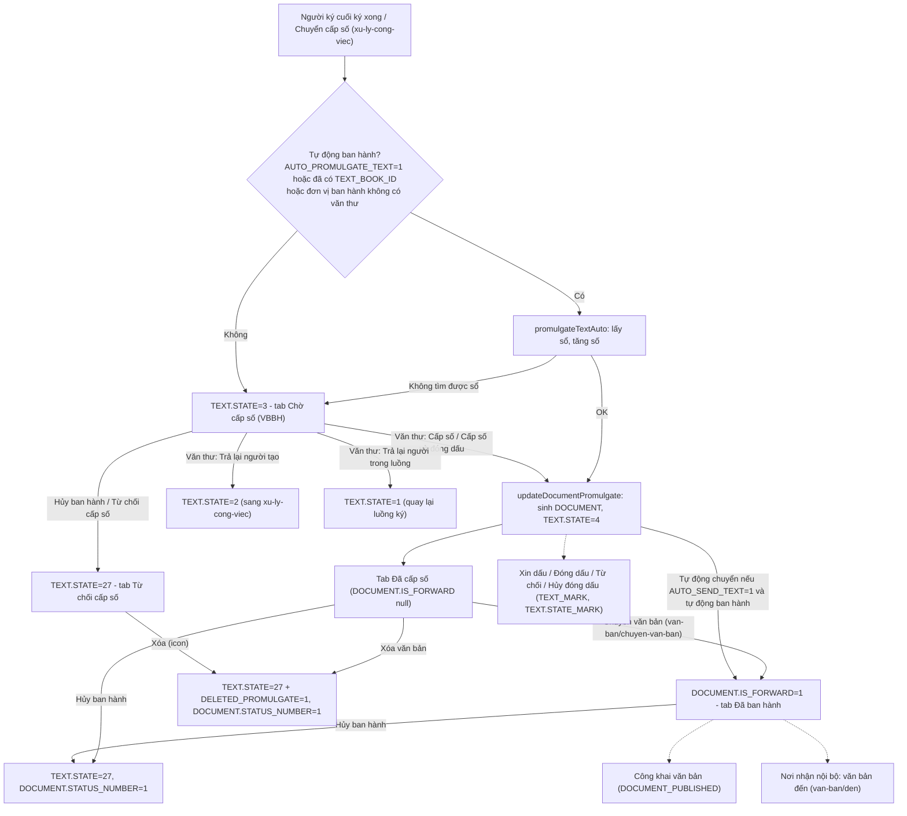

### 4.2 Sequence — Cấp số (thủ công)

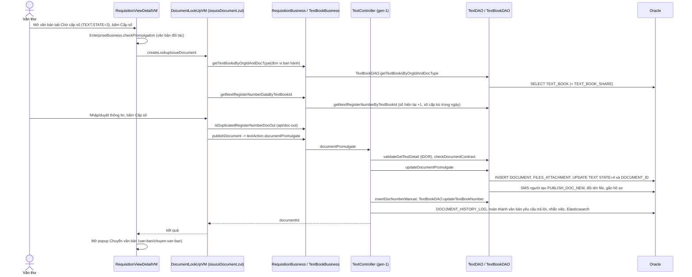

### 4.3 Sequence — Đóng dấu (xin dấu → đóng dấu)

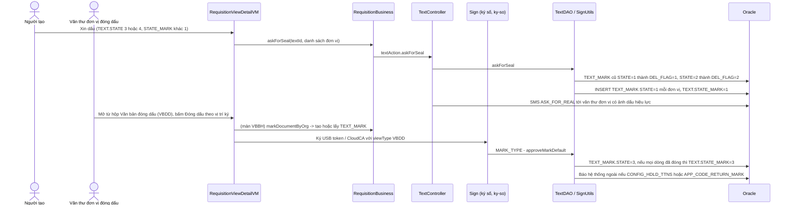

### 4.4 Sequence — Ban hành tự động và bàn giao chuyển văn bản

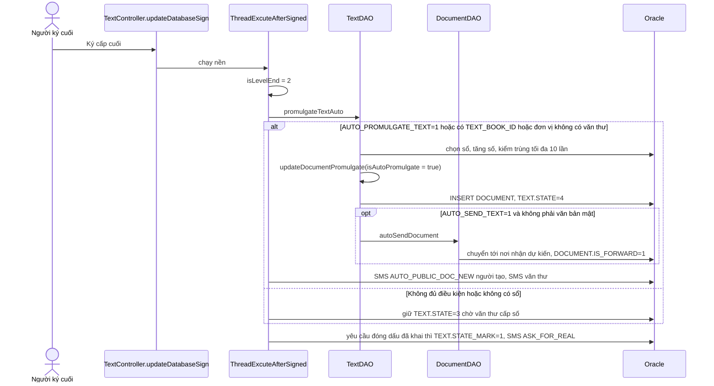

### 4.5 Sequence — Hủy ban hành / Từ chối cấp số

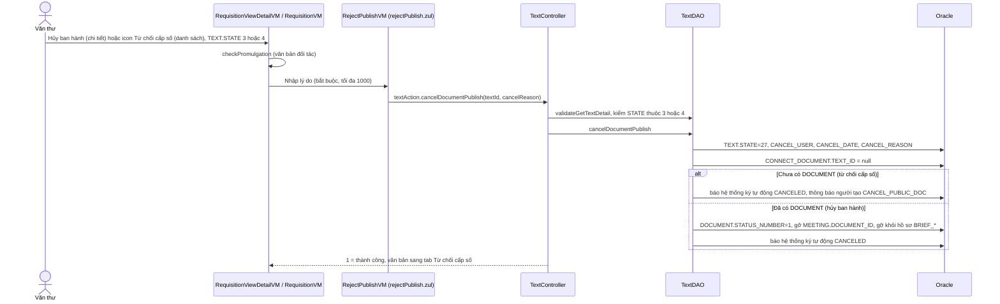

### 4.6 Sequence — Văn thư trả lại văn bản chờ cấp số

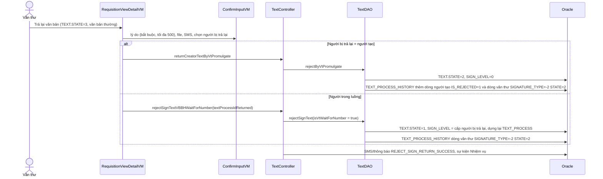

### 4.7 State — `TEXT.STATE` sau ký (giá trị thật: `BE1/constants/Constants.java:788-839`, `:1083, 1107`)

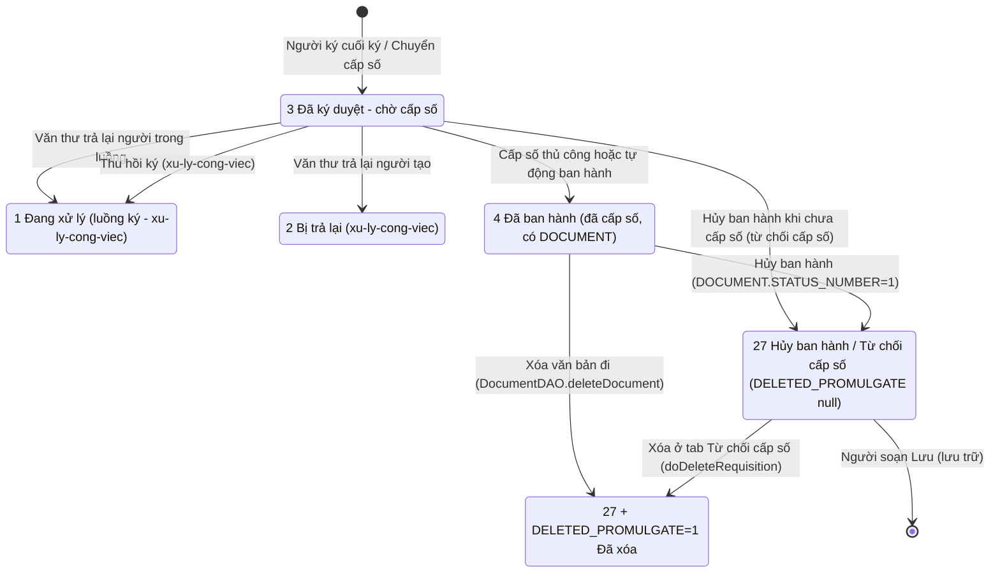

DB DEV 2026-09-30: `TEXT.STATE` có 0,1,2,3,4,6,7,27,28 (không có 5); `STATE = 27` gồm 19 dòng `DELETED_PROMULGATE` null và 37 dòng `= 1`.

### 4.8 State — `DOCUMENT` văn bản đi (`IS_FORWARD`, `STATUS_NUMBER`)

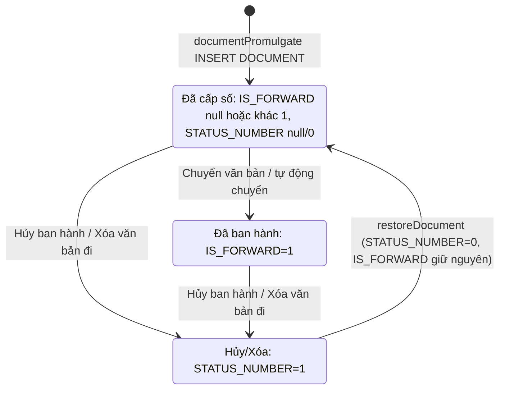

DB DEV 2026-09-30 (`DOCUMENT` có `IS_ARRIVE = 0`): `IS_FORWARD=1` 836 dòng, null 617 dòng; `STATUS_NUMBER=1` 46 dòng.

### 4.9 State — Đóng dấu (`TEXT_MARK.STATE` và `TEXT.STATE_MARK`)

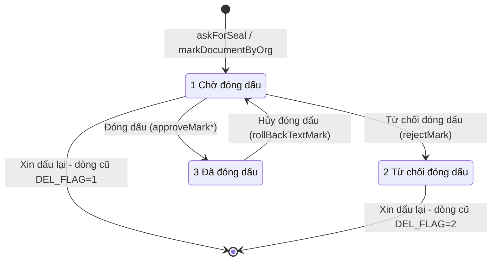

`TEXT.STATE_MARK` theo dõi tổng: 1 khi có yêu cầu chờ, 2 khi bị từ chối, 3 khi mọi dòng đã đóng; hủy đóng dấu trả về 1 (TDAO:6593, 6618, 7384, 8171-8178).

### 4.10 State — Công khai (`DOCUMENT_PUBLISHED.STATUS`)

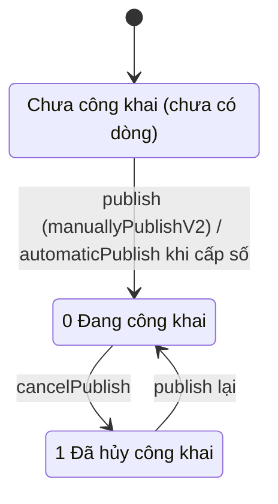

## 5. Data model

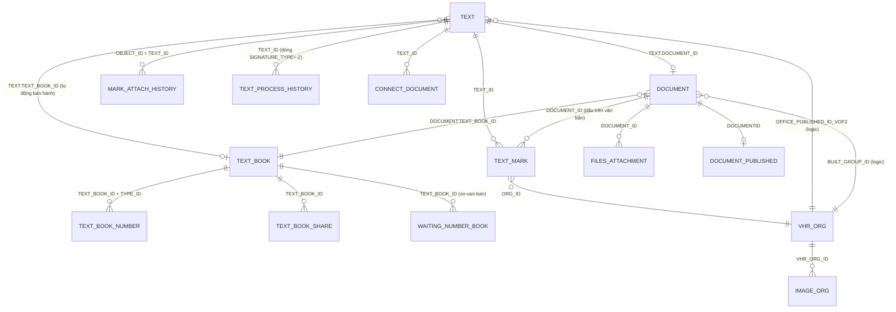

Bằng chứng: `LEFT JOIN text t ON d.document_id = t.document_id`, `LEFT JOIN text_book tb ON d.text_book_id = tb.text_book_id`, `text_mark tm WHERE (tm.document_id = d.document_id OR tm.text_id = t.text_id)` (DocumentSearchOutService:183-188, 221-229); `JOIN TEXT_MARK m ON t.TEXT_ID = m.TEXT_ID` (TSDAO:7342); `LEFT JOIN text_mark tm ... tm.org_id` (TSDAO:3338-3348); `TEXT_BOOK_SHARE tbs JOIN TEXT_BOOK tb ON tbs.text_book_id = tb.text_book_id` (TBDAO:1228-…); `UPDATE TEXT_BOOK_NUMBER ... WHERE TEXT_BOOK_ID = ? AND TYPE_ID = ?` (TBDAO:1403-1412); `JOIN TEXT_BOOK tb ON tb.TEXT_BOOK_ID = d.TEXT_BOOK_ID` (TBDAO:1182-1185); `INSERT INTO files_attachment (DOCUMENT_ID, … ATTACH_ID …)` (TDAO:4192-4197); `INSERT INTO MARK_ATTACH_HISTORY (… OBJECT_ID, TYPE, EMP_VHR_ID, ORG_VHR_ID, PATH_BEFORE, … ATTACH_ID)` (SignUtils:5341-5352); `IMAGE_ORG i ON i.VHR_ORG_ID = t.ORG_ID` (TDAO:6500-6502); `UPDATE CONNECT_DOCUMENT SET TEXT_ID = null WHERE TEXT_ID = ?` (TDAO:4024); `DOCUMENT_PUBLISHED.DOCUMENTID` (cột thật, DB DEV); `WaitingNumberBookRepositoryJPA.findByTextBookIdAndDelFlagNot…` (`BE2/repositories/jpa/WaitingNumberBookRepositoryJPA.java:30`). Quan hệ là **logic** (không thấy FK trong code).

| Bảng.cột | Vai trò nghiệp vụ | Nguồn |
|---|---|---|
| `TEXT.STATE` | 3 chờ cấp số, 4 đã ban hành, 27 hủy ban hành/từ chối cấp số | `BE2/entities/TextEntity.java:44`; Constants :788-839 |
| `TEXT.DELETED_PROMULGATE` | 1 = đã xóa (kèm `STATE = 27`) | `DocumentDAO.java:1033-1036`; TDAO:10551-10560 |
| `TEXT.OFFICE_PUBLISHED_ID_VOF2/NAME_VOF2` | Đơn vị ban hành → văn thư nào thấy ở Chờ cấp số; thành đơn vị gửi/đơn vị đăng ký của DOCUMENT | `TextEntity.java:116-119`; TDAO:2736-2742 |
| `TEXT.REGISTING_NUMBER_DATE/COMMENT` | Dự thảo "Chuyển cấp số" không qua luồng | `TextEntity.java:231`; TSDAO:3353 |
| `TEXT.TEXT_BOOK_ID`, `REGISTER_NUMBER` | Sổ/số đã chọn trước (văn thư xét duyệt) → kích hoạt tự động ban hành | `TextEntity.java:77, 219`; `ThreadExcuteAfterSigned.java:762, 795-812` |
| `TEXT.AUTO_PROMULGATE_TEXT` | Tự động ban hành | `TextEntity.java:131` |
| `TEXT.AUTO_SEND_TEXT`, `STATUS_AUTO_SEND_TEXT` | Tự động chuyển sau ban hành tự động / đã tự chuyển | `TextEntity.java:134, 240`; `DocumentDAO.java:14893` |
| `TEXT.IS_PUBLIC` | Tự động công bố khi ban hành | TDAO:2688, 2724-2727 |
| `TEXT.STATE_MARK` | Tổng trạng thái đóng dấu 1/2/3 | `TextEntity.java:164` |
| `TEXT.CANCEL_USER_ID/NAME`, `CANCEL_DATE`, `CANCEL_REASON` | Người/ngày/lý do hủy ban hành hoặc xóa | TDAO:4115-4140; `TextEntity.java:86, 176` |
| `TEXT.IS_PUBLISH_OUTSIDE` | Phát hành nội bộ / ra ngoài | `TextEntity.java:209` |
| `TEXT.SIGNER_NAME` | Người ký ghi vào DOCUMENT | `TextEntity.java:225`; DLVM:940 |
| `DOCUMENT.REGISTER_NUMBER`, `CODE`, `TEXT_BOOK_ID`, `PROMULGATE_DATE` | Số, số ký hiệu, sổ, ngày văn bản | `BE2/entities/DocumentEntity.java:31, 37, 203, 43` |
| `DOCUMENT.IS_FORWARD` | 1 = đã chuyển (tab Đã ban hành) | `DocumentEntity.java:85`; DocumentSearchOutService:262-273 |
| `DOCUMENT.STATUS_NUMBER` | 1 = hủy ban hành / đã xóa | `DocumentEntity.java:94`; TDAO:4145-4157 |
| `DOCUMENT.BUILT_GROUP_ID` | Đơn vị ban hành (phạm vi đơn vị của văn thư) | `DocumentEntity.java:177`; DocumentSearchOutService:343-349 |
| `DOCUMENT.DELETED_DATE/BY/REASON` | Xóa văn bản đi; nguồn số cấp bù trong ngày | `DocumentEntity.java:230`; `DocumentDAO.java:1015-1024`; TBDAO:1196-1197 |
| `DOCUMENT.IS_PUBLIC`, `PROCESS_TYPE` | Đã công khai | `DocumentDAO.java` `updateProcessTypeAndIsPublicByDocumentId` |
| `TEXT_BOOK.CURRENT_NUMBER`, `NUMBER_TYPE`, `IS_DEFAULT`, `YEAR`/`YEAR_TYPE`/`FROM_YEAR`/`TO_YEAR`, `TEXT_DEFAULT` | Bộ đếm số; đánh số theo sổ (0) hay theo sổ + thể loại (1); sổ mặc định; hiệu lực năm; ký hiệu sổ | `BE2/entities/TextBookEntity.java:41, 97, 62, 44`; TBDAO:1064-1124, 1228-… |
| `TEXT_BOOK_NUMBER.CURRENT_NUMBER` | Bộ đếm theo (sổ, thể loại) | TBDAO:1076-1090, 1403-1412 |
| `TEXT_MARK.STATE`, `ORG_ID`, `GROUP_ID`, `DEL_FLAG`, `RECEIVED_DATE`, `MARKED_DATE`, `NOTE`, `NOTE_REQUIRE_MARK`, `CANCEL_ID/DATE`, `DOCUMENT_ID` | Yêu cầu/kết quả đóng dấu của từng đơn vị (`DEL_FLAG` 0 hiệu lực, 1 hủy, 2 từ chối cũ) | TDAO:6543-6588, 7514; cột thật DB DEV |
| `TEXT_PROCESS_HISTORY` dòng `SIGNATURE_TYPE = -2` | Văn thư ban hành đã trả lại (tab Đã trả lại) | TDAO:6680-6699, 7158-7168; `Constants.java:1007` (`-2` văn thư cấp số) |
| `DOCUMENT_PUBLISHED.STATUS` | 0 công khai, 1 hủy | `DocumentDAO.java:1757-1775, 2474` |

## 6. Glossary

| Nghiệp vụ | Trong code |
|---|---|
| Văn bản ban hành (menu) | `SYS_MENU.CODE = VBBH`, `requisition_vbbh.zul`, `RequisitionVbbhVM`, `REQUISITION.VIEW_TYPE.VBBH = 8`, search `TYPE_VBBH = 4` = `SearchType.PUBLISHED_SIGN` |
| Chờ cấp số | tab `waitForNumberTab`, `TEXT.STATE = 3` (`COMBOBOX_MENU.VBBH.DKD`); `VIEW_TYPE.VBCCS = 19` chỉ là hằng không dùng |
| Đã cấp số / Đã ban hành / Tất cả | tab `numberedTab`/`issuedTab`/`allTab`, `DOCUMENT.VBBH.VIEW_TYPE.DCS = 8 / DBH = 9 / ALL = 10` = `PUBLISHED_DOCUMENT_TYPE.YET_DELIVERED / DELIVERED / ALL_DOC_OUT`; phân biệt bằng `DOCUMENT.IS_FORWARD` |
| Đã trả lại (của văn thư) | tab `returnForNumberTab`, `TAB_TYPE.VTBH_TL = 15`, `Text.State.VTCS_RETURNED = 15`, `TEXT_PROCESS_HISTORY.SIGNATURE_TYPE = -2` |
| Từ chối cấp số / Hủy ban hành | tab `cancelIssueTab`, `TEXT.STATE = 27` (`CANCEL_PUBLISHED`, `TEXT_STATE_APPROVED_CANCEL`), `cancelDocumentPublish`, `rejectPublish.zul`, `docDestroyTab`, `doRejectPromulgate` |
| Đã xóa (văn bản đi) | `STATE = 27` + `DELETED_PROMULGATE = 1`, bộ lọc `DELETE = 299`, `deleteDocument`, `doDeleteRequisition` |
| Phạm vi đơn vị / cá nhân | `orgRangeState`, `ORG_RANGE.INCLUDE_CHILDREN = 0` (đơn vị) / `ORG_ONLY = 1` (cá nhân), `promulIndex` |
| Cấp số | `docCreateTab`, `issussDocument.zul`, `DocumentLookUpVM.saveDocument`, `publishDocument`, `textAction.documentPromulgate`, `updateDocumentPromulgate` |
| Cấp số & đóng dấu | `issueAndMark`, `DocumentEntity.isMark = 1` |
| Số tiếp theo / cấp bù số | `getNextRegisterNumberByTextBookId`, `NextRegisterNumberDTO(nextNumber, reusedNumber)`, REQ-254 |
| Văn thư trả lại | `doRejectVBBHWaitForNumber`, `returnCreatorTextByVtPromulgate`, `rejectSignTextVBBHWaitForNumber`, `rejectByVtPromulgate` |
| Tự động ban hành | `AUTO_PROMULGATE_TEXT`, `promulgateTextAuto`, `isAutoPromulgate` |
| Xin dấu | `askForSeal`, `TEXT_MARK.STATE = 1`, `TEXT.STATE_MARK = 1`, SMS `ASK_FOR_REAL` |
| Đóng dấu / theo vị trí ký / tùy chọn | `doApproveMark`, `doApproveMarkPosition`, `markDocumentByOrg`, `approveMark*`, `MARK_TYPE`, `VIEW_TYPE.VBDD = 9`, `TYPE_VBDD = 8`, `SearchType.MARK` |
| Từ chối đóng dấu | `rejectMark`, `TEXT_MARK.STATE = 2` |
| Hủy đóng dấu | `doRollBackDDDV`, `rollBackDauDonVi`, `checkPermissionRollBack`, `rollBackDauXacNhan` (dấu xác nhận) |
| Ảnh dấu đơn vị | `IMAGE_ORG`, `IMAGE_ORG_CONFIG`, `GROUP_TYPE` 1 đơn vị / 2 xác nhận / 3 hồ sơ |
| Công khai văn bản | `DocumentPublishVM`, `DOCUMENT_PUBLISHED`, `DocumentAction.publish/cancelPublish`, `IS_PUBLIC` |
| Văn bản thay thế | `DocumentPublishReplaceVM`, `ALTERNATIVE_DOCUMENT_ID`, `DOCUMENT_ALTERNATIVE`, `getListDocAlter` |
| Đơn vị ban hành thay thế (KHÁC văn bản thay thế) | `OfficePublishedReplacementService.replaceOrgId`, `DRAFT_APPROVAL_PUBLISH_ORG_REPLACE` |
| Phát hành ra ngoài | `IS_PUBLISH_OUTSIDE` |
| Văn thư | role `VT` (`SYS_ROLE_ID` 336954 trên DB DEV), `RbParamValue.USER_ROLE.DOCUMENT_MANAGER`, `isDocManager`, `listSecretaryVhrOrg`, `orgDocManagerIds` |

## 7. [CẦN XÁC NHẬN]

### 7.1 Còn mở

(Không còn câu hỏi mở — mọi câu đã xác nhận ở 7.2.)

### 7.2 Đã xác nhận (2026-10-01, người trả lời: chủ dự án)

| # | Câu hỏi (tóm tắt) | Trả lời | Ghi vào |
|---|---|---|---|
| Q1 | "Văn thư chuyên quản" (`ORG_HAVE_DOC_MANAGER`) và vì sao hộp Chờ cấp số / Đóng dấu lọc khác nhau | Màn **Chờ cấp số chỉ văn thư của đơn vị thấy**; văn thư **phụ trách cấp số cho văn bản của đơn vị mình**. Hai hộp **không cần lọc giống nhau** — giữ như nghiệp vụ hiện tại | BR-03, NV-01, NV-07 |
| Q4b | Hủy ban hành văn bản đã gửi liên thông có báo thu hồi sang trục không | Phần gửi/thu hồi qua trục chạy ở **tiến trình ngoài hệ thống**, chủ dự án không nắm; tri thức chỉ cần mô tả **phần bên trong hệ thống** (gỡ `CONNECT_DOCUMENT.TEXT_ID`) | NV-05 |
| Q2 | BE trả mã `1001` cho `documentPromulgate` ở đâu | Có thể trả ra nhưng **chưa dùng** | `dac-thu.md` bẫy 18 |
| Q3 | Khôi phục có cần đưa `TEXT` ra khỏi 27 | **Không** — nghiệp vụ hiện tại chỉ khôi phục `DOCUMENT` | BR-18, NV-15 |
| Q4 | Hủy ban hành không thu hồi văn bản ở người nhận, không SMS | **Đúng ý đồ** (liên thông: chưa rõ → Q4b) | NV-05 |
| Q5 | Ý nghĩa `TEXT_BOOK.AUTO_PROMULGATE` | **Tự động cấp số**: văn thư xét duyệt đã vào sổ thì lãnh đạo ký xong cấp số luôn | BR-34, NV-10 |
| Q6 | "Văn bản thay thế" khi công khai thủ công không được lưu | **Có thể là lỗi** — ghi nhận | `dac-thu.md` bẫy 12 |
| Q7 | `IS_PUBLISH_OUTSIDE` có kích hoạt liên thông | **Chỉ thông tin** | BR-41 |
| Q8 | Mobile có cấp số/đóng dấu/hủy ban hành | **Có** (chưa thấy API riêng trên `kha_develop`) | NV-17 |
| Q9 | "Từ chối cấp số" vs "Hủy ban hành" | **Đúng**: từ chối cấp số = hủy khi chưa có số; hủy ban hành = hủy khi đã có số (cùng `cancelDocumentPublish`) | NV-05, Glossary |
| Q10 | `results.get(51)` ở RVDVM:10244 | **Lỗi hệ thống — ghi nhận, để đó** (không thuộc phạm vi xây tri thức) | `dac-thu.md` bẫy 8 |
| Q11 | Hai endpoint trả lại không kiểm IDOR | **Không cần** — nhiệm vụ là xây tri thức, không sửa lỗi | — |
| Q12 | Tab Đã ban hành (cá nhân) không lọc `IS_FORWARD` | `IS_FORWARD` dùng để biết văn bản **đã cấp số đã được chuyển đi chưa**; đã chuyển thì sang tab **Đã ban hành** | NV-01, NV-11 |

## 8. Nội dung chuyển văn bản (đã chuyển sang `van-ban/chuyen-van-ban`)

> (sửa 2026-10-01) Tri thức cũ "QT10" và "bẫy cũ 10–12" từng giữ tạm ở đây đã được module `van-ban/chuyen-van-ban` rà lại và **gỡ khỏi file này**. Kết luận: phạm vi chuyển "đơn vị ngang cấp có mã định danh" (`isDocManagerTransferOut`, `/api/vhr-org/get-doc-manager-transfer-*`) **không có trên `kha_develop`** — chỉ có ở nhánh đang phát triển `taipd/feature/YC_VT_PH(_fe)`; tab Cá nhân **ẩn hẳn** người ngoài phạm vi (không phải disable). Xem [`../chuyen-van-ban/nghiep-vu.md`](../chuyen-van-ban/nghiep-vu.md) NV-03 (hiện trạng, BR-11) và mục 7 (thay đổi chưa merge).
