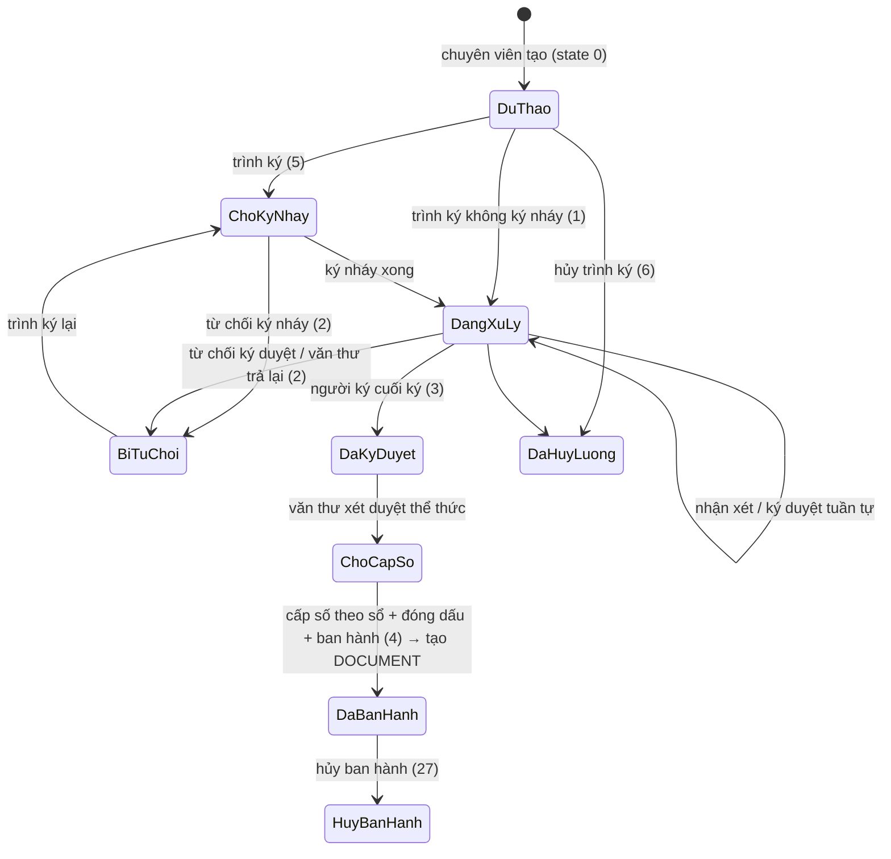

# Văn bản đi — nghiệp vụ: dự thảo → trình ký → ký → cấp số → ban hành

> Trong code, văn bản đi **trước khi ban hành** là `TEXT` (web: `requisition/*`, BE: `textAction`, `TextController`, `TextDAO`, gen-2 `text-draft`/`text-process`). **Sau khi ban hành** nó trở thành `DOCUMENT` (web `document/documentPublish`, BE `DocumentAction.publish`, gen-2 `/api/doc-out`). Xem `_chung/thuat-ngu.md`.

## 1. Actor

| Actor | Vai trò hệ thống | Làm gì |
|---|---|---|
| Chuyên viên soạn thảo | `SYS_ROLE_NV` | Tạo dự thảo, chọn luồng ký, chọn người ký nháy/nhận xét/ký duyệt, đính kèm phiếu trình / sở cứ, trình ký, trình ký lại khi bị trả |
| Người ký nháy | lãnh đạo phòng / người được chọn | Soát nội dung, ký nháy hoặc từ chối (`signatureType = 2`) |
| Người nhận xét / nhận xét bổ sung | bất kỳ ai được chọn | Cho ý kiến, không ký (`vbnx`) |
| Lãnh đạo ký duyệt | `SYS_ROLE_LDDV`, `TTDV`… | Ký duyệt (USB token / CloudCA / SIM CA / ký ảnh) hoặc từ chối (`signatureType = 3`); có thể chuyển người ký khác, ủy quyền trợ lý (`transferGiveAdvice`, `transferToPreSigner`) |
| Văn thư | `SYS_ROLE_VT` | Xét duyệt thể thức (`signatureType = 1`, có thể trả lại), cấp số theo sổ, đóng dấu (`markDocumentByOrg`), ban hành (`documentPromulgate`), hủy ban hành, công khai |
| Trợ lý / thư ký | `SYS_ROLE_TL`, `SECRETARY` | Đăng ký/duy trì ảnh chữ ký, chuyển văn bản chờ ký cho lãnh đạo (`updateSignImageBySecrectary`, `tranferProofreadingAsistant`) |

## 2. Vòng đời & trạng thái

### 2.1 Trạng thái văn bản (`TEXT.STATE` — `TextStateConstants`, BE gen-1 `Constants.TEXT_STATE_*`)

| Mã | Enum | Hiển thị | Ý nghĩa |
|---|---|---|---|
| 0 | `NOT_SUBMITTED` | Chưa trình ký (Dự thảo) | Chuyên viên đang soạn |
| 5 | `PENDING_INITIALS` | Chờ ký nháy | Đã trình, đang ở bước ký nháy |
| 1 | `PROCESSING` | Đang xử lý / Đang trình ký / Đang xin ý kiến | Đang đi qua các bước ký/nhận xét |
| 2 | `REJECTED` | Bị từ chối / Bị trả lại | Một người trong luồng từ chối → chuyên viên sửa, **trình ký lại** (`da.trinh.ky.lai`) |
| 3 | `SIGNED` | Đã ký duyệt (Đã ký, chờ cấp số) | Người ký cuối đã ký; chuyển văn thư |
| 4 | `ISSUED` | Đã ban hành | Đã cấp số + ban hành → có bản ghi `DOCUMENT` |
| 6 | `CANCELED` | Đã hủy luồng | Người trình hủy trình ký |
| 7 | `NOT_RESUBMITTED` | Không được trình ký lại | Bị từ chối và khóa trình lại |
| 27 | `CANCEL_ISSUED` | Hủy ban hành | Văn thư/lãnh đạo hủy sau khi ban hành (`cancelDocumentPublish`, `rollBackDauDonVi`) |

Trạng thái hiển thị thêm ở web (`vbtk.vbtkMapFull`): *Chờ nhận xét, Đã nhận xét, Đã chuyển cấp số, Đã cấp số* — là tổ hợp của `STATE` + trạng thái bước (`TEXT_PROCESS`) + cột cấp số, không phải mã riêng.

### 2.2 Trạng thái từng bước (`TEXT_PROCESS` — `TextProcessStateConstants`: `state × signatureType`)

| signatureType | Bước | state 0 | state 2 | state 4 |
|---|---|---|---|---|
| 1 | Văn thư xét duyệt | Văn thư chưa xét duyệt | Văn thư đã từ chối | Văn thư đã xét duyệt |
| 2 | Ký nháy | Chờ ký nháy | Từ chối ký nháy | Đã ký nháy |
| 3 | Ký duyệt | Chờ ký duyệt | Từ chối ký duyệt | Đã ký duyệt |

Loại bước (`requisitionProcess.type`): **ký nháy**, **nhận xét**, **nhận xét bổ sung**, **ký duyệt**, **xét duyệt** (văn thư). Người ký có thể ký **tuần tự** hoặc **song song** (`STATE_SIGN_PRALLEL = -1`).

### 2.3 Sơ đồ

## 3. Các bước nghiệp vụ chi tiết

1. **Tạo dự thảo** (`requisition_add.zul`): trích yếu, loại văn bản (`DOCUMENT_TYPE`), độ mật (`securityLevel`: bình thường/mật/tối mật/tuyệt mật), độ khẩn (`priority`), lĩnh vực, sổ văn bản dự kiến, file chính (bắt buộc, đếm trang `countMainSigningFilePages`), phụ lục (`requisition_addAppendix.zul`), file sở cứ = văn bản đã ban hành trước đó (`fileBaseAttachment`), **phiếu trình đính kèm** (xem mục 4), người nhận (cá nhân/đơn vị/đối tác `listPartner`), tuỳ chọn tự động ban hành (`AUTO_PROMULGATE`) và tự động gửi (`getAutoSendText`).
2. **Chọn luồng ký** (`requisitionFlow` — cá nhân / đơn vị / tập đoàn; cấu hình ở `van-ban/luong-xu-ly`): danh sách người ký nháy, nhận xét, ký duyệt; thứ tự; kiểm tra chính tả (`checkSpellText`) và thể thức.
3. **Trình ký** → tạo các bản ghi `TEXT_PROCESS` cho từng người; thông báo/SMS.
4. **Ký nháy / nhận xét / ký duyệt**: từng người vào màn hình tương ứng (menu "KÝ ĐIỆN TỬ": *Văn bản ký nháy, Văn bản nhận xét, Văn bản nhận xét bổ sung, Văn bản ký duyệt*); ký bằng USB token (`signUsbToken.zul`), CloudCA (`Sign.SignCloudCA`), SIM CA (`Sign.SignTextByCASIM`) hoặc ký ảnh; có thể **chuyển người ký** (`updateSigner`, lưu `GetHistoryOfSignerChange`), **xin ý kiến thêm** (`transferGiveAdvice`, tối đa `MAX_LEVEL_SWITCH_GIVE_ADVICE = 3` cấp), **từ chối** kèm lý do (`rejectSignText`).
5. **Văn thư xét duyệt** (menu *Văn bản trình duyệt*): kiểm tra thể thức; trả lại (`rejectSignDocByVTAction`) với lý do mặc định "Đề nghị kiểm tra thể thức, chính tả…".
6. **Cấp số** (`requisition_issue_number_view_detail.zul`, `RequisitionViewIssueNumberVM`): chọn sổ (`TEXT_BOOK`), số tiếp theo `getNextRegisterNumberByTextBookId`; có hàng chờ cấp số (`WaitingNumberBookEntity`).
7. **Đóng dấu** (menu *Văn bản đóng dấu*, `markDocumentByOrg`, `askForSeal`, tối đa 10 văn bản/lần `MAX_CONCURRENT_SELECTED_DOCUMENTS_MARK`), có thể **đóng dấu nhiều đơn vị** (`getListOrgMultiMarkRequisition`).
8. **Ban hành** (`documentPromulgate` / `DocumentAction.publish`): sinh `DOCUMENT`, gửi tới người nhận / đơn vị nhận (thành văn bản đến của họ), liên thông ra ngoài nếu có (`van-ban/lien-thong`), đánh index tìm kiếm.
9. **Sau ban hành**: xem ở *Văn bản ban hành* (`requisition_vbbh.zul`: *Chờ cấp số / Đã cấp số / Đã ban hành / Hủy ban hành*), **hủy ban hành** (`cancelDocumentPublish`, `checkPermissionRollBack`), **công khai** (`document/documentPublish` — *chưa/đã/hủy công khai*), **văn bản thay thế** (`document_publish_replace.zul`, `OfficePublishedReplacement`), đưa vào hồ sơ (`addDocDraftToBrief`).

## 4. Liên hệ với phiếu trình (xác nhận từ nghiệp vụ)

- Chuyên viên tạo dự thảo → trình ký; người xử lý vào **`requisition`** để ký / cho ý kiến. (`documentDraft/*` là bộ màn cũ đã chết ☠.)
- **Case 1 — phiếu trình đính kèm dự thảo chưa trình**: nếu **người ký cuối của phiếu trình = người ký dự thảo** thì khi ký phiếu trình có thể **ký luôn văn bản** (`submissionFormProcess` tab *"Dự thảo chờ ký"*, `confirmSignDocumentDraft.zul`).
- **Case 2 — dự thảo đính kèm phiếu trình đã hoàn thành**: phiếu trình đóng vai trò sở cứ.
- Kiểm tra ràng buộc: `api.submission-manager.submission-form.check-submission-attachments-for-submitting`, `textAction.searchTextForSubmission`.

## 5. Quy tắc nghiệp vụ (rút từ code + i18n)

- QT1. Phải có file trình ký hoặc file đính kèm mới được trình (`warning.spell.emptyFile`).
- QT2. Văn bản bị từ chối phải **trình ký lại** (tạo vòng mới, giữ lịch sử); trạng thái 7 = không được trình lại.
- QT3. Mỗi bước ký ghi `TEXT_PROCESS_HISTORY`; đổi người ký ghi `HISTORY_CHANGE_SIGN`.
- QT4. Chỉ văn thư của đơn vị ban hành được cấp số/đóng dấu/ban hành; cấu hình "văn thư đơn vị" (`menu.quantri.cau.hinh.van.thu.don.vi`).
- QT5. Số văn bản duy nhất theo sổ + năm (sổ `TEXT_BOOK`, khóa sổ `toggleLockTextBook`).
- QT6. Hủy ban hành cần quyền (`checkPermissionRollBack`) và ghi lý do; văn bản đến đã phát sinh ở đơn vị nhận phải được thu hồi ❓ (cần xác nhận cơ chế).
- QT7. Độ mật ≥ Mật: file mã hóa (`FileEncryptMap`), hạn chế người xem (`getPermisionReadFileEncryptMap`).
- QT8. Chuyên viên có thể **khóa/mở khóa** văn bản đang xử lý (`lockDocument`/`unLockDocument`).
- QT9. Đọc/chưa đọc theo người (`updateReadingStatusV2` / `updateUnReadingStatusV2`).
- QT10. **Phạm vi chuyển của văn thư phát hành** (màn *Văn bản ban hành* DCS/DBH/ALL, user là văn thư của chính đơn vị ban hành, chuyển 1 văn bản): chỉ được chọn **cấp cha** (tổ tiên của đơn vị ban hành), **đơn vị ban hành**, **toàn bộ con cháu của đơn vị ban hành**, và **đơn vị ngang cấp có mã định danh** (`VHR_ORG.IDENTIFIER_CODE`, không cần cùng cha; "ngang cấp" = **cùng độ sâu `PATH`**, không dùng `ORG_LEVEL` vì dữ liệu `ORG_LEVEL` sai so với `PATH`). Không được chọn đơn vị con của cơ quan ngang cấp. Cây bên trái chỉ để **lọc/điều hướng** (tổ tiên của đơn vị ngang cấp nhánh khác vẫn click được để mở xuống); việc chặn nằm ở **danh sách bên phải**: tab Đơn vị chỉ liệt kê đơn vị hợp lệ, tab Cá nhân **disable checkbox** user thuộc đơn vị ngoài phạm vi. (Yêu cầu KH 2026-09; BE `POST /api/vhr-org/get-doc-manager-transfer-scope` + `-children`, cây lazy-load từng cấp.)

## 6. Màn hình theo `VIEW_TYPE` (`AppConstants.REQUISITION.VIEW_TYPE`)

| viewType | Màn | Người dùng |
|---|---|---|
| 11 `VBDT` | Văn bản dự thảo (của tôi) | Chuyên viên |
| 1 `VBTK` | Văn bản trình ký | Chuyên viên theo dõi |
| 4 `VBKN` | Văn bản ký nháy | Người ký nháy |
| 32 `VBNX` / 64 `VBNXBS` | Nhận xét / nhận xét bổ sung | Người cho ý kiến |
| 5 `VBKD` (tab `CXL/DXL/TL/DQH/DXLCBH/DGXL/DPD`) | Văn bản ký duyệt | Lãnh đạo |
| 2 `VBXD` | Văn bản trình duyệt (văn thư) | Văn thư |
| 19 `VBCCS` | Chờ cấp số | Văn thư |
| 9 `VBDD` | Đóng dấu | Văn thư |
| 8 `VBBH` | Văn bản ban hành | Văn thư/lãnh đạo |
| -1 `VBTC` | Tra cứu | Mọi người |

## 7. Báo cáo

`TextReportAction`: thời gian xử lý (`ReportTextProcessingTime`), số lần bị từ chối (`ReportTextRejectionCount`, `reportTextRejectedDetail/Sumary`), thời gian ký (`reportTimeSignText`), báo cáo văn bản trình ký (`reportRequisiton` — `requisitionReport.zul`).

## 8. ❓ Cần người xác nhận

1. Hủy ban hành có tự thu hồi văn bản đến ở đơn vị nhận không, hay chỉ đổi trạng thái?
2. `TYPE_VBDT_V2 = 12` — màn dự thảo bản 2 khác gì bản 1?
3. Ký song song (`STATE_SIGN_PRALLEL`) áp dụng cho bước nào (ký nháy? nhận xét?).
4. "Văn bản phê duyệt" (`VBPD = 7`, menu *Công văn phê duyệt*) là gì so với ký duyệt?
5. Tự động ban hành (`AUTO_PROMULGATE`) cấu hình ở đâu, áp dụng loại văn bản nào?
